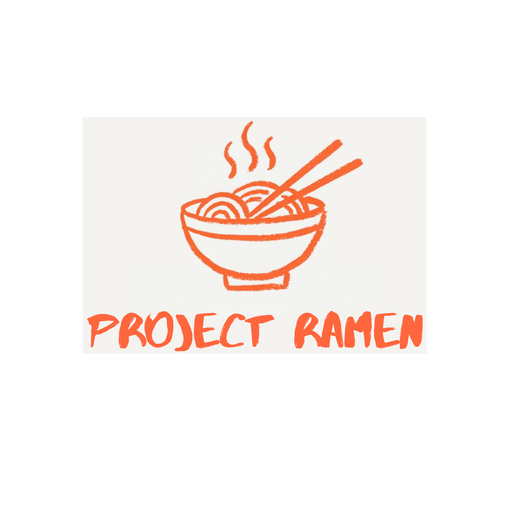
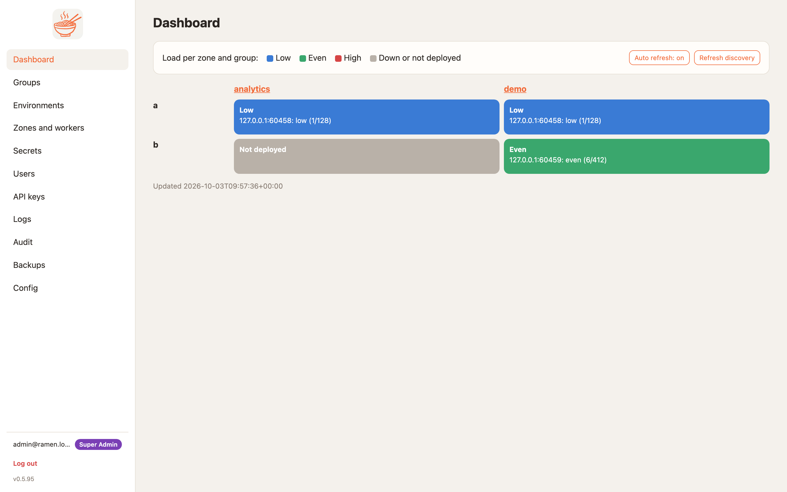
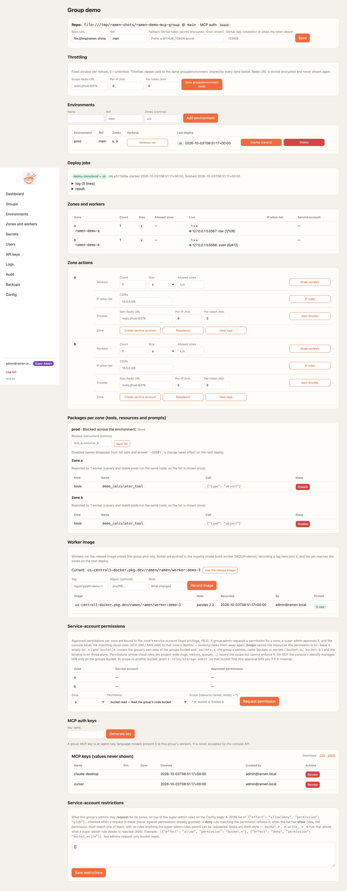
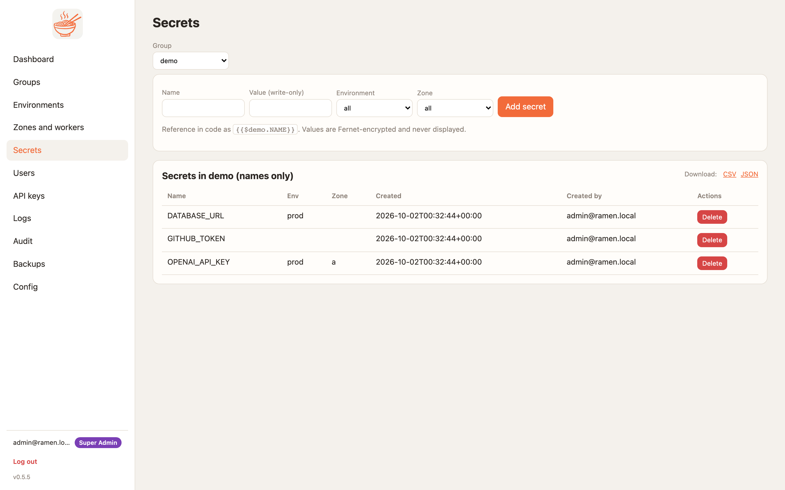
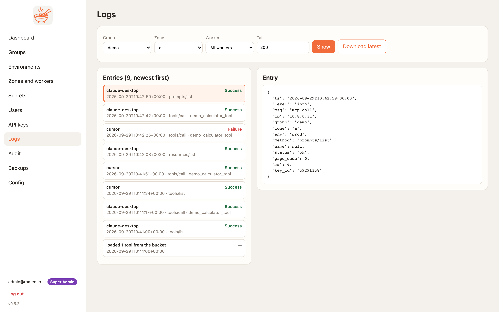

<p align="center"></p>

<p align="center">Multizone, highly available, enterprise-grade <b>MCP server</b> for GCP and AWS Kubernetes.<br>
Rust MCP node + Python 3.14 runtime workers, Streamable HTTP at the edge and gRPC inside, managed from a FastAPI console.</p>

<p align="center">
<a href="https://github.com/bkraad47/ramen/releases"></a>
<a href="https://github.com/bkraad47/ramen/actions/workflows/ci.yml"></a>
<a href="https://bkraad47.github.io/ramen/"></a>
<a href="LICENSE"></a>
<a href="https://modelcontextprotocol.io"></a>
</p>

<p align="center"><a href="https://glama.ai/mcp/servers/bkraad47/ramen"></a></p>

**Docs: https://bkraad47.github.io/ramen/** · [Get started](https://bkraad47.github.io/ramen/get-started/) · [The MCP repo](https://bkraad47.github.io/ramen/wiki/mcp-repo/) · [Connect a client with OAuth](https://bkraad47.github.io/ramen/wiki/connect-oauth/) · [How it works](https://bkraad47.github.io/ramen/how-it-works/) · [Deploy on GCP](https://bkraad47.github.io/ramen/wiki/deploy-gcp/) · [Deploy on AWS](https://bkraad47.github.io/ramen/wiki/deploy-aws/) · [Contracts](docs/CONTRACTS.md) · [Releases](https://github.com/bkraad47/ramen/releases)

> **Streamable HTTP is the front door.** Every worker serves `POST /mcp` — a URL and a bearer header, nothing to
> install — next to the gRPC service it has had since 0.3.1, on the same port, through the same guards. Phones,
> browsers and hosted agent platforms connect directly; the stdio bridge stays for clients that only speak stdio.
> Per-user access through OAuth (the console is the authorization server), live-verified on GKE since 0.5.1.

**What is true today, before the pitch.** Current release **0.6.23**. The local stack and CI prove both
transports on real node processes on Linux and Windows. One GKE cluster has proved the gRPC path end to end
(0.3.2, 0.4.0) and the HTTP path with OAuth through the same load balancer (0.5.1, with a publicly trusted
certificate since 0.5.5). The AWS path has been applied to a real account since 0.5.6, and the published bridge
was server-tested against it in 0.5.8. 0.6.1 itself was deployed on both, two zones each, on 2026-10-04/05:
canary deploys (the stable track waits for the canary), `POST /mcp` over HTTP/1.1 and HTTP/2 through the load
balancer, per-token throttling shared across zones through Redis, OAuth sign-in through the bridge, the base URI,
and zone teardown. Everything below is written so those lines stay findable.

**Build and deploy your own MCP tools across zones.** Ramen turns a **git repo of tools, resources and prompts** into a fleet of MCP workers behind a cloud load balancer, and keeps who-can-call-what, secrets, canary gates and the audit trail in one console. It is a platform for *your* tools, not a gateway in front of someone else's.
Each worker pairs a **Rust MCP node** (Streamable HTTP and gRPC, bearer auth, IP allow-lists, health, logs) 1:1 with a
**Python 3.14 runtime** that pip-installs and runs your code. One **console** manages groups (tenants), environments,
zones, secrets, canary deploys, rebalancing, IP rules, logs, audit and backups — in the browser or through an API key.

- **Git → bucket → worker.** Deploy syncs the repo to a bucket; workers load by content hash. No git creds on pods.
- **Canary by default, gated.** Roll a canary, smoke-test `tools/list`, diff its tool schemas against stable
  (breaking changes stop unless you say `breaking: true`), run the repo's golden cases, then roll stable. Failure
  leaves stable untouched.
- **Multi-zone from day one.** Group → Environment → Zone → Worker; the LB routes on `ramen-group` / `ramen-zone`
  metadata, so one client config works for every zone.
- **Enterprise controls.** A role per group (Group Admin, Viewer or MCP User) plus global super admins, `rmk_` MCP keys, `rmn_` API keys, IP rules (per
  zone at the node, one Cloud Armor policy per group at the edge), secrets that are never displayed, an audit
  line for every action.
- **Transport: Streamable HTTP at the edge, gRPC inside.** `POST /mcp` for any client that can make an HTTP
  request; `ramen.v1.Mcp/Call` for teams that want gRPC internally. One set of guards serves both — the same
  functions, spelled `401 / 403 / 429` on one and `UNAUTHENTICATED / PERMISSION_DENIED / RESOURCE_EXHAUSTED` on the
  other — so the two paths cannot drift.
- **Cheaper: one Deployment per zone, not one per tool.** A worker is one Rust node plus one Python runtime that loads *every* tool of
  the group. A team with thirty small tools runs them on **one Deployment per zone** (two pods with a canary),
  behind one load balancer. Container-per-MCP-server designs run thirty. Autoscaling adds pods for load, not for
  tool count.
- **Secure, in one sentence.** User code never runs in the process that holds the keys and does the auth: the Rust
  node checks every call and hands the message to a separate Python process it can kill and respawn.

## Built on how organizations work

Groups own tools in git, environments pin a ref and a set of zones, people hold a role per group, agents and
clients sign in as themselves, and every deploy is a canary, a smoke test and a rollout. Underneath it is gRPC,
JSON-RPC 2.0 and a Rust node; **you code in Python**. The longer argument is
[How it works and why](https://bkraad47.github.io/ramen/how-it-works/).

> **Start here** · the demo group repo **[ramen-demo-mcp-group](https://github.com/bkraad47/ramen-demo-mcp-group)**
> (point a group at it and press Deploy) · the stdio bridge **[ramen-mcp-bridge on PyPI](https://pypi.org/project/ramen-mcp-bridge/)**
> (`pip install ramen-mcp-bridge`; signs you in with `--oauth` or carries a group key) · HTTP clients such as
> Claude Code, Claude Desktop and Cursor need neither: they connect with a group key, and Claude Code can also
> [sign you in with OAuth](https://bkraad47.github.io/ramen/wiki/connect-oauth/).
> Every feature and where it is managed: [How it works](https://bkraad47.github.io/ramen/how-it-works/).

## Quickstart (local, 5 commands)

Needs Docker with compose v2, `uv`, `git` and `make`. The first run builds two images and takes three to five minutes.

```sh
git clone https://github.com/bkraad47/ramen && cd ramen
make up       # Firestore emulator + console https://localhost:8443 + one worker (localhost:8080: Streamable HTTP + gRPC)
make demo     # zone, group `demo` from the demo repo, an rmk_ key, a canary deploy, then a tools/call
#   PASS: demo_calculator_tool(2,3,add) -> 5      <- the success line
open https://localhost:8443    # self-signed cert; login admin@ramen.local / changeme-ramen
make down     # stop and remove volumes
```

`make demo` is safe to re-run: an existing zone, group or environment answers "exists" and a fresh key is
generated each time.
Then connect your own client with an **`rmk_` MCP key** (Groups → demo → *Generate key* → Deploy). It is a URL and
a header — put the key in `RAMEN_MCP_KEY` and drop this into any `mcpServers` config:

```json
{"mcpServers": {"ramen-demo": {"url": "http://localhost:8080/mcp",
  "headers": {"Authorization": "Bearer ${RAMEN_MCP_KEY}", "ramen-group": "demo", "ramen-zone": "local"}}}}
```

Anything that can make an HTTP request is a client:
```sh
curl -s http://localhost:8080/mcp -H "Authorization: Bearer $RAMEN_MCP_KEY" -H 'Content-Type: application/json' \
  -H 'ramen-group: demo' -H 'ramen-zone: local' \
  -d '{"jsonrpc":"2.0","id":1,"method":"tools/call","params":{"name":"demo_calculator_tool","arguments":{"var1":2,"var2":3,"func":"add"}}}'
# {"jsonrpc":"2.0","id":1,"result":{"content":[{"type":"text","text":"5"}],"isError":false}}
```

Clients that only speak stdio use the bridge, which forwards to the same worker over gRPC:
```sh
pip install ramen-mcp-bridge                # its own package (github.com/bkraad47/ramen-mcp-bridge); also in the worker image
RAMEN_MCP_KEY=<the key shown once> ramen-mcp-bridge --target localhost:8080 --insecure --group demo --zone local
```

> `rmk_` **MCP keys** go to workers (`Authorization: Bearer`, on HTTP or as gRPC metadata) and are generated on
> the **group page**. `rmn_` **API keys** go to the console (`X-Ramen-Api-Key`) for automation and are generated
> on the **API keys** page. They are not interchangeable. For a token scoped to one *person* rather than a shared
> key, register an OAuth client on the Config page: the worker's `401` tells an OAuth-capable client where to
> sign in. Full walkthrough with the `mcp` SDK and a raw `grpcurl` call:
> [Get started](https://bkraad47.github.io/ramen/get-started/)
> (also in [`deploy/local/README.md`](deploy/local/README.md)).

## Screenshots

| Login | Dashboard, load per zone and group |
|---|---|
|  |  |

| Group: environments, deploy jobs, zones/workers, MCP keys | Deploy job with streamed log |
|---|---|
|  |  |

| Secrets (names only, values never shown) | Logs (one JSON line per MCP call, downloadable) |
|---|---|
|  |  |

## Transport, and what secures each hop

Workers speak **Streamable HTTP** (`POST /mcp`, one JSON-RPC 2.0 message per request, MCP spec 2025-06-18) **and
gRPC** (`ramen.v1.Mcp/Call`, one message as `bytes body`) on the same port ([contract §16](docs/CONTRACTS.md),
[§11](docs/CONTRACTS.md)). MCP itself is unchanged — your client and your tools see the standard messages. The two
transports share one implementation of every check: the HTTP handler turns the request headers into the same
metadata map and calls the same guard and dispatch functions the gRPC service calls, so a check added to one is on
both or on neither.

**Why the node is Rust.** A worker runs two processes with one job each. `ramen-node` (Rust + tonic) owns what must
not be slowed down or broken by user code: the gRPC surface, key checking, source-range checking, the blocked-name
filter, concurrency bounds, deadlines, health and the access log. It is a small static binary with no interpreter
and no user code in its address space. `ramen_runtime` (Python 3.14) owns what users write: `pip install`, validation,
secret substitution, the call. They talk over newline-delimited JSON-RPC on stdin/stdout ([§2](docs/CONTRACTS.md)),
so there is no extra socket to secure, and the runtime is killed after an idle timeout — a crash or leak in tool
code costs one respawn, not the process holding the keys.

| Hop | What protects it |
|---|---|
| client → edge (HTTP) | TLS at the load balancer; the credential in `Authorization: Bearer` (an `rmk_` key or a per-user OAuth token); browser origins only from the zone's allowlist; session ids signed and bound to the credential |
| client → bridge → edge (stdio) | a child process on the client's own machine, speaking gRPC to the edge; plaintext unless `--tls` (`--ca <pem>` pins the certificate) |
| edge → node | TLS ends at the load balancer; h2c to the node unless the node has its own certificate; Cloud Armor (GCP) or WAF (AWS) IP rules, one policy per group |
| every `Mcp/Call` | constant-time key compare; source range against the right `x-forwarded-for` entry; blocked names; 4 MiB and in-flight caps |
| edge → node, without a key | only `grpc.health.v1.Health`; reflection is off on deployed workers |
| anything else → the pod | the worker `NetworkPolicy` plus a hardened container context |
| node → runtime | stdio inside the pod; no network surface |
| runtime → bucket | the zone's own cloud identity (GCP service account with Workload Identity, AWS IAM role with IRSA), scoped to the group's prefix and secrets |
| console → node | cluster-internal, never through the load balancer; `Admin/*` needs an admin key and an admin CIDR |

Five details behind that table matter in practice. The origin allowlist is empty by default, so every browser
`Origin` is refused until you add one. The source-range check reads the `x-forwarded-for` entry a proxy appended
(hop count 2 on GCP, 1 on AWS), and a wrong count denies rather than admits. The allowlist itself defaults to
everything until you set IP rules. An IP lock must include the console's own range, because a deploy smoke-tests
`tools/list` as an ordinary call. `grpc.health.v1.Health` is deliberately unauthenticated so load balancers can
probe it, and reports `SERVING` only once the runtime has loaded the group's code.

**What is verified, in four lines.**
- Both transports through every guard, on real node processes, in CI on Linux and on a Windows runner that builds
  the node natively (0.5.0).
- The GCP path live through the Gateway load balancer on a throwaway project every release, most recently 0.6.1
  with two zones, OAuth, the Redis throttle and a real teardown.
- The AWS path applied to a real account in 0.5.6, 0.5.8, 0.6.0 and 0.6.1, each emptied the same day; the published
  bridge server-tested against it in 0.5.8.
- Covered by tests only, never on a real load balancer: node TLS, and the size and in-flight caps.
- By design, a group's code runs in a process that holds that group's secrets. Isolation between groups is the
  pod, the namespace and the per-zone identity.

Full write-up: [Transport and what secures each hop](https://bkraad47.github.io/ramen/wiki/transport/).

## Deploy to the cloud

| Target | Status | Guide |
|---|---|---|
| **GCP** — GKE Autopilot, Firestore, GCS, Secret Manager, global HTTPS LB (GKE Gateway, header-routed gRPC **and** Streamable HTTP, gRPC health checks), Cloud Armor | verified on a throwaway project every release, most recently 0.6.1: two zones, OAuth, the Redis throttle shared across zones, real zone teardown | [docs](https://bkraad47.github.io/ramen/wiki/deploy-gcp/) · [`deploy/README.md`](deploy/README.md) |
| **AWS** — EKS, DynamoDB, S3, Secrets Manager, ALB (gRPC and HTTP/1.1 target groups), WAF (Terraform or CloudFormation) | applied to a real account since 0.5.6; bridge server-tested in 0.5.8 | [docs](https://bkraad47.github.io/ramen/wiki/deploy-aws/) |
| **Local** — docker compose | CI e2e on every push | [`deploy/local/README.md`](deploy/local/README.md) |

Bring-up on GCP is `terraform apply` → `make push` → `helm upgrade --install` → add a zone and a group in the
console → Deploy. About 25 minutes, mostly waiting for GKE and the load balancer. The load balancer gets a
publicly-trusted certificate automatically (a free `sslip.io` hostname derived from the static IP — no domain to
buy, since 0.5.5). Clients then use `https://<public_hostname>/mcp` with `Authorization: Bearer rmk_` and the
`ramen-group` / `ramen-zone` headers (the same address serves the console and, by those headers, every zone);
stdio-only clients point the bridge at `<public_hostname>:443 --tls` — no `--ca`, nothing to import.

## Write your own tools

Full guide with the demo repo, `env.yaml` and local development: [The MCP repo, structure and local development](https://bkraad47.github.io/ramen/wiki/mcp-repo/).

A group repo is any git repo with `mcp/tools/<name>/<name>.py` + `<name>.json` (and `resources/`, `prompts/`,
`requirements.txt`). Start from [ramen-demo-mcp-group](https://github.com/bkraad47/ramen-demo-mcp-group); the
contract is in [the MCP repo page](https://bkraad47.github.io/ramen/wiki/mcp-repo/). Secrets are referenced as
`{{$group.NAME}}` and substituted by the runtime at call time. Nothing about the transport leaks into tool code.
Declare `output` and the worker publishes it as `outputSchema` and validates every result; add `mcp/tests.yaml` and
your cases gate every deploy (0.7.0).

## Repository

| Dir | What |
|---|---|
| [`console/`](console/) | FastAPI + Jinja2 + HTMX manager UI and `/api/v1`; gRPC client to workers |
| [`node-rs/`](node-rs/) | Rust MCP server node (tonic: `ramen.v1.Mcp`, `ramen.v1.Admin`, `grpc.health.v1.Health`; auth, CIDRs, sidecar supervisor) |
| [`runtime-py/`](runtime-py/) | Python 3.14 runtime (loads protos, pip installs, runs calls, resolves secrets) |
| [`proto/`](proto/) | `ramen/v1/mcp.proto`, `admin.proto` — the transport contract, single source for Rust and Python stubs |
| [`deploy/`](deploy/) | compose, Helm charts, Terraform (GCP, AWS), CloudFormation |
| [`skills/`](skills/) | Cloud-ops agent skills: deploy-gcp, deploy-aws, rotate-keys, backup-restore, scale-zone |
| [`tests/`](tests/) | Black-box conformance (gRPC + bridge), e2e and cloud suites |
| [`docs/`](docs/) | This site's sources; [`docs/CONTRACTS.md`](docs/CONTRACTS.md) is binding for every component (§11 = transport) |

Architecture: [ARCHITECTURE.md](ARCHITECTURE.md) · Changes: [CHANGELOG.md](CHANGELOG.md) · Versions: [tracker](https://bkraad47.github.io/ramen/versions/)

## Develop

```sh
make test            # runtime-py and console (pytest, 90% coverage gate) plus node-rs (fmt, clippy, test)
make test-harness    # tests/: conformance + e2e (skips without a running stack)
make proto           # regenerate Python stubs from proto/ (Rust stubs build via tonic-build)
make demo-worker     # node + runtime locally without Docker
uv run --project docs --group docs mkdocs serve   # docs at http://127.0.0.1:8000
```

## Contributing

See [CONTRIBUTING.md](CONTRIBUTING.md) — use it, fork it, change it, with attribution; renaming it as a new commercial product of your own is not acceptable. Related repositories and which versions go together: [Releases](https://bkraad47.github.io/ramen/release/).

## License
BSD-3-Clause © 2026 Raad. See [LICENSE](LICENSE).
