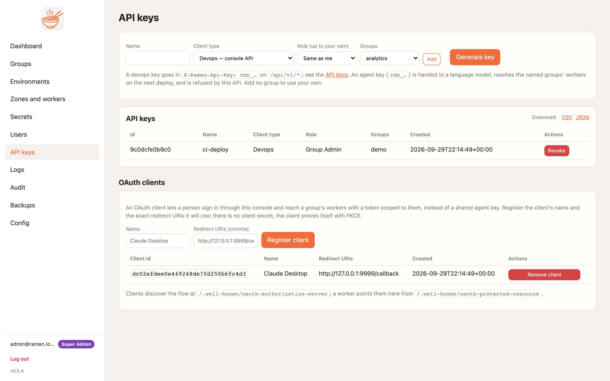

# DevOps with the API and keys

Everything the console does is a JSON route under `/api/v1` ([contract §4a](../CONTRACTS.md)). OpenAPI UI at
`/api/docs`. Authenticate with a session cookie (`POST /login`) or an **`rmn_` API key** in `X-Ramen-Api-Key`.
The console API stays HTTP in 0.3.1; what changed is how the console talks to **workers**: every worker call
(`Admin/Reload`, `Admin/Metrics`, `Health/Check`, the `tools/list` smoke) is gRPC now ([§11](../CONTRACTS.md)).

## Generate an API key
API Keys page → name, role, groups → **Create** (shown once), or:
```sh
curl -sk -c c.txt -X POST https://<console>/login -d email=admin@ramen.local -d password='…' -o /dev/null
CSRF="X-Ramen-CSRF: $(awk '$6=="ramen_csrf"{print $7}' c.txt)"   # cookie sessions must echo the CSRF token
curl -sk -b c.txt -H "$CSRF" -H 'Content-Type: application/json' -X POST https://<console>/api/v1/api-keys \
  -d '{"name":"ci-deploy","role":"group_admin","groups":["demo"]}'
# 201 {"id":"…","key":"rmn_…"}
export RMN=rmn_…
```
A key can never be wider than its creator. Keep `rmn_` keys in CI secrets; they are for the **console** only —
MCP clients need `rmk_` keys (see [local quickstart](local-quickstart.md#rmk_-vs-rmn_-two-different-keys)).

<figure markdown>
{ .ramen-shot }
</figure>

## Cheat sheet
`C='curl -sk -H "X-Ramen-Api-Key: $RMN" -H "Content-Type: application/json"'`, `U=https://<console>/api/v1`.

| Task | Call |
|---|---|
| Who am I | `GET $U/me` |
| Users (super admin) | `POST $U/users {email,password,role,groups}` · `GET/DELETE $U/users/{id}` · `POST $U/users/{id}/password` |
| Groups | `POST $U/groups {name,repo_url,ref}` · `PUT $U/groups/{g}` · `DELETE $U/groups/{g}` (destroys infra) |
| Zones (super admin) | `POST $U/zones {name,provider,region}` |
| Environments | `POST $U/groups/{g}/environments {name,ref,zones}` · `PUT/DELETE …/environments/{e}` |
| Deploy | `POST $U/groups/{g}/environments/{e}/deploy {canary,zone?}` → 202 `{id}`; `GET $U/jobs/{id}` until `ok`/`error` (job log shows `health`, `reload`, `smoke` steps over gRPC) |
| Verbose logging | `POST …/environments/{e}/verbose {verbose}` |
| Block tools (v0.3.0) | `PUT …/environments/{e}/blocked {blocked:[names]}` then deploy |
| Workers | `GET $U/groups/{g}/zones/{z}/workers` (live rows from `Admin/Metrics` + `Health/Check`) · `PUT … {count,size?,allowed_sizes?}` |
| Rebalance / IP rules | `POST …/zones/{z}/rebalance` · `PUT …/zones/{z}/ip-rules {cidrs}` |
| Service account | `POST …/zones/{z}/service-account` (super admin) · `PUT $U/groups/{g}/sa-restrictions {rules}` |
| Permission requests | `POST $U/requests {group,zone,permission}` · `GET $U/requests` · `POST $U/requests/{id}/approve` |
| Take a grant back (v0.4.1) | `POST $U/requests/{id}/deny` (pending) · `POST $U/requests/{id}/revoke` (approved) · `DELETE $U/groups/{g}/zones/{z}/permissions/{permission}` |
| Worker image per group (v0.4.1) | `GET $U/groups/{g}/images` · `POST $U/groups/{g}/images {tag,digest?,note?}` · `PUT $U/groups/{g}/images/current {id}` · `DELETE $U/groups/{g}/images/current` |
| Secrets | `POST $U/groups/{g}/secrets {name,value,env?,zone?}` · `GET` (names) · `DELETE …/secrets/{id}` |
| MCP keys | `POST $U/groups/{g}/mcp-keys {name}` → `{key:"rmk_…"}` · `DELETE …/mcp-keys/{id}` |
| API keys | `POST $U/api-keys {name,role?,groups?}` · `DELETE $U/api-keys/{id}` |
| Logs | `GET $U/logs?group=&zone=&worker=&tail=500&download=1` (text/plain) |
| Audit / dashboard | `GET $U/audit` · `GET $U/dashboard` |
| Backups (super admin) | `POST $U/backups {target:"local"|"bucket"}` → `{id,release_version}` · `GET $U/backups/{id}/download` · `POST $U/backups/{id}/restore {dry_run?,prune?,reconcile?,force?}` |
| Config (super admin) | `GET $U/config` · `POST $U/config/reload` · `GET|PUT $U/config/sa-rules` · `PUT $U/config/auth` · `POST $U/refresh` |

## A CI deploy job
```sh
JOB=$(eval $C -X POST $U/groups/demo/environments/prod/deploy -d "'{\"canary\":true}'" | python3 -c 'import sys,json;print(json.load(sys.stdin)["id"])')
for i in $(seq 1 150); do
  S=$(eval $C $U/jobs/$JOB | python3 -c 'import sys,json;print(json.load(sys.stdin)["status"])')
  [ "$S" = ok ] && echo PASS && exit 0; [ "$S" = error ] && { eval $C $U/jobs/$JOB; exit 1; }; sleep 2
done; echo timeout; exit 1
```

## Talking to a worker directly (gRPC)
The console is the normal path, but the worker's admin surface is reachable with any gRPC client from inside
`RAMEN_ADMIN_CIDRS` (locally `localhost:8080`; in a cluster `kubectl -n ramen-<g>-<z> port-forward svc/worker 8080`).
Run from the repo root so `-proto` resolves:
```sh
grpcurl -plaintext -H "x-ramen-admin-key: $RAMEN_ADMIN_KEY" -import-path proto -proto ramen/v1/admin.proto \
  localhost:8080 ramen.v1.Admin/Metrics | python3 -c 'import sys,json,base64;print(base64.b64decode(json.load(sys.stdin)["json"]).decode())'
# {"inflight":0,"total":12,"errors":0,"load":"low","sidecar_alive":true,"loaded_at":"…","packages":{…}}
grpcurl -plaintext -H "x-ramen-admin-key: $RAMEN_ADMIN_KEY" -import-path proto -proto ramen/v1/admin.proto \
  localhost:8080 ramen.v1.Admin/Reload                          # re-sync bucket, pip install if needed, runtime.load
grpc_health_probe -addr localhost:8080                          # SERVING / NOT_SERVING, no key needed
```
Without the key: `Unauthenticated`; from outside the admin CIDRs: `PermissionDenied`. Tool calls need an `rmk_`
key and go through `ramen.v1.Mcp/Call` — see the [local quickstart](local-quickstart.md#5-call-the-worker-raw-with-grpcurl).

## Backups
`POST $U/backups {"target":"bucket"}` writes a JSON export tagged with the release version (zones, users without
password hashes, groups, environments, workers, config; **no secrets**) to `<bucket root>/_backups` (local) or the
groups bucket.

Restore with `POST $U/backups/{id}/restore` ([contract §13.1](../CONTRACTS.md)), whose four flags all default to
false:

| Flag | What it does |
|---|---|
| `dry_run` | Returns the plan — created, updated, unchanged and what the store has that the backup does not — and writes nothing. Run this first. |
| `prune` | Deletes the groups, zones, environments, workers and users the backup does not contain. `config` is never pruned and the account running the restore is never deleted. |
| `reconcile` | Re-applies every restored zone, so counts, sizes and image pins take effect in the cluster. Namespaces the cloud still runs that the backup never knew about come back as `orphans` — reported, never deleted. |
| `force` | Restores a backup taken on a **newer** release than this console. Without it that is a 409. |

A restore merges each document over the live one, so the fields a backup strips (password hashes, secret values,
GitHub tokens) survive it. It bumps every restored user's session epoch: everyone else is signed out immediately, so
a role a restore lowers cannot be outlived by an open session. A user the store no longer has comes back with
`login_disabled` — the backup holds no hash — until a password reset or an SSO sign-in. See the
[backup-restore skill](../wiki/skills.md).

## Pin a worker image per group
Groups run the release worker image until one is recorded for them ([§13.3](../CONTRACTS.md), F9.3). The console
records and recalls references; it never builds, so it needs no registry credentials:

```sh
make build-worker GROUP=demo                       # ramen-worker:<version>-demo
make push-worker  GROUP=demo PROJECT=<gcp project> # <region>-docker.pkg.dev/<project>/ramen/worker:<version>-demo
eval "$C" -X POST $U/groups/demo/images -d '{"tag":"<that reference>","note":"pandas 2.3"}'   # 201, pinned
eval "$C" -X POST $U/groups/demo/environments/prod/deploy -d '{"canary":true}'                # rolls the zones
```
`GET $U/groups/demo/images` lists the history with the pinned one flagged `current`. To go back to a build that
worked, `PUT $U/groups/demo/images/current {"id":"<older id>"}` and deploy again; `DELETE
$U/groups/demo/images/current` returns the group to the release image. A reference needs a `:tag` or a recorded
`sha256:` digest — there is no implicit `latest`, because "recall that build" has to mean something.

## Config yaml
`RAMEN_CONFIG=/path/ramen.yaml` — top-level keys map to `RAMEN_*` (nested keys join with `_`), env wins;
`POST $U/config/reload` hot-reloads. OAuth providers, SMTP, SA rules and auth toggles live here.

## Logs page
<figure markdown>
{ .ramen-shot }
</figure>
