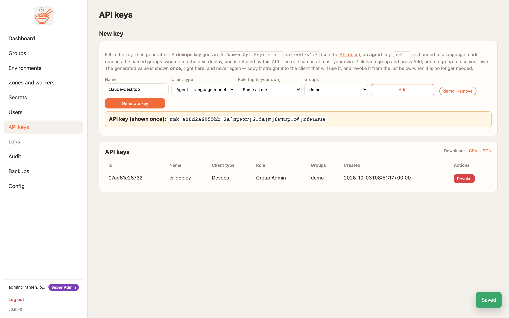
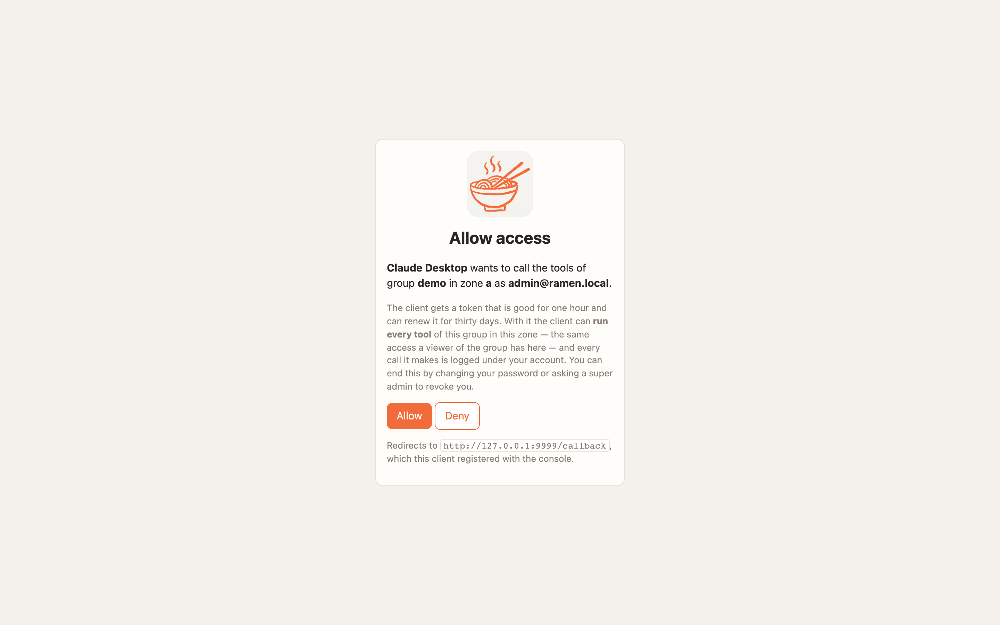
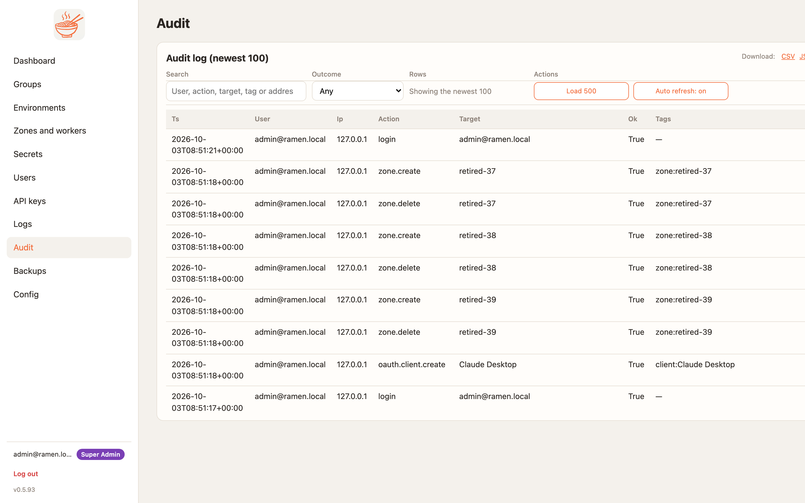
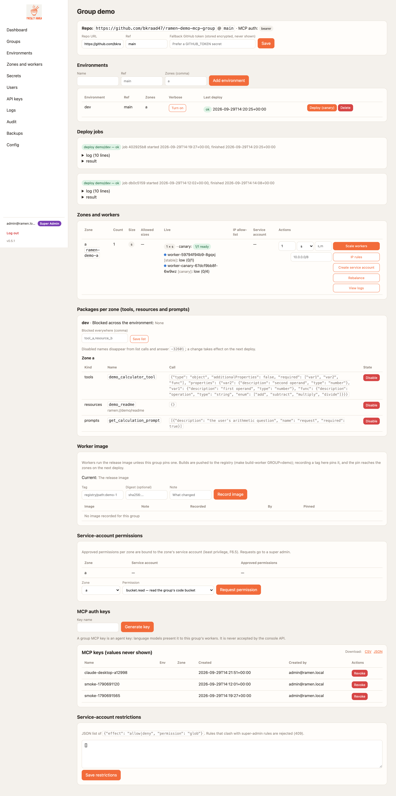
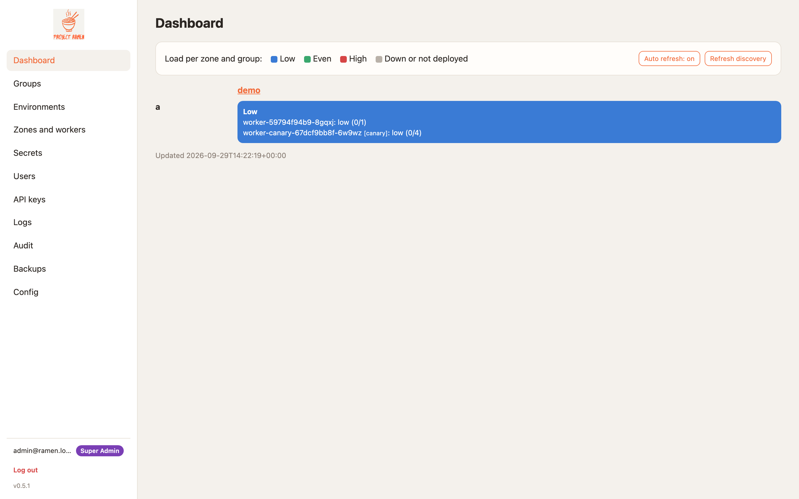
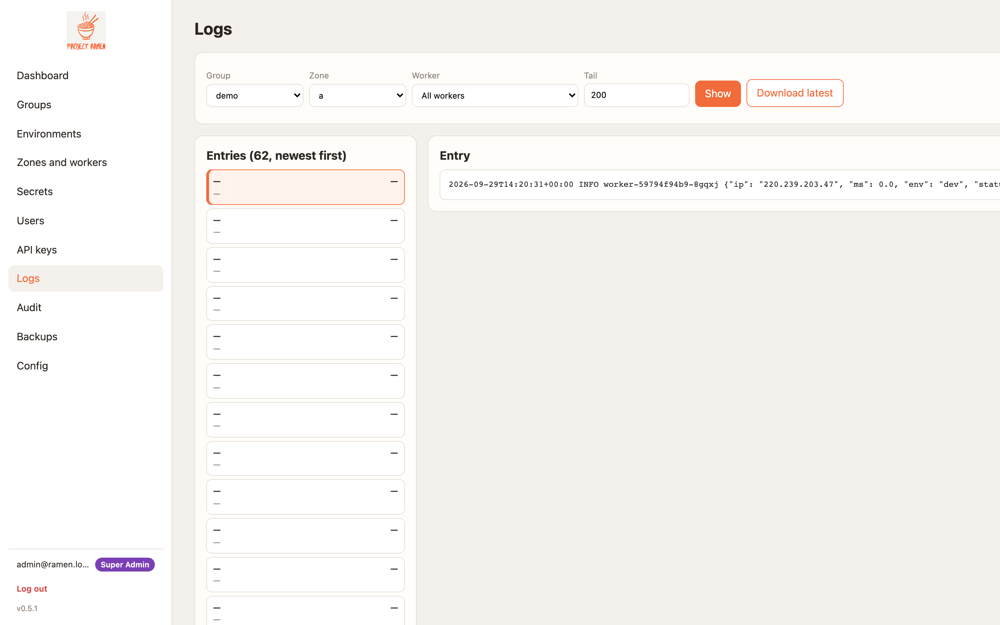

# End to end: console → worker → AI client

One story, told twice: first on your laptop with the compose stack, then on GKE. The steps are numbered the same in
both halves, so once you have done it locally the cloud run is the same muscle memory with different addresses.
Every console step has a screenshot from a seeded console (your names will differ, the pages will not); the client
side is the exact configuration a client needs plus the real transcript of the call.

What you end up with: a group of MCP tools deployed from a git repo, reachable at a URL with a bearer key by any
Streamable HTTP client — Claude Desktop, Cursor, the `mcp` SDK, `curl` — and, optionally, by a person through
their own OAuth token instead of a shared key.

## Part 1 — Local (compose)

### 1. Start the stack and sign in
```sh
git clone --recurse-submodules https://github.com/bkraad47/ramen && cd ramen
make up                       # Firestore emulator + console (https://localhost:8443) + one worker (http://localhost:8080)
```
Open `https://localhost:8443/` (self-signed certificate; accept the warning) and sign in with the admin from
`deploy/local/.env` (`admin@ramen.local` / `changeme-ramen` unless you changed it — do, before anyone else can reach
the port).

{ .ramen-shot }

### 2. A zone
The local stack has one zone already: `local`, provider `local`, which is the worker container on port 8080. Nothing
to add. On GKE this is where you create one; see Part 2.

### 3. A group and an environment
**Groups → Add group**: name `demo`, repo `https://github.com/bkraad47/ramen-demo-mcp-group`, ref `main`. Then on
the group page, **Add environment**: name `default`, zone `local`. A group is one git repo of tools; an
environment is that repo at a ref, deployed to a set of zones.

{ .ramen-shot }

### 4. An agent key
**API keys**: name it after the client (`claude-desktop`), client type **Agent — language model to worker**, add the
group `demo`, **Generate key**. The `rmk_` key is shown once. Put it in your shell, not in a file:
```sh
export RAMEN_MCP_KEY='rmk_…'
```

{ .ramen-shot }

An agent key opens the group's workers and is refused by the console API; a devops key (`rmn_`) is the other way
round. Keys reach the workers on the next deploy.

### 5. Deploy
Group page → environment row → **Deploy (canary)**. The job log shows sync → canary → reload (the first run also
installs the group's `requirements.txt`, one to three minutes) → smoke → stable.

{ .ramen-shot }

The dashboard now shows load per zone and group; the worker answers `/mcp` as soon as the job says `ok`.

{ .ramen-shot }

### 6. Connect an AI client over Streamable HTTP
The worker is `http://localhost:8080/mcp`. Every client sends three headers: the key, and the group and zone the
cloud load balancer routes on (a single local worker ignores them; keep them anyway so the config moves to the
cloud unchanged).

=== "Claude Desktop"
    *Settings → Developer → Edit Config* opens `claude_desktop_config.json`. Add the server and restart Claude:
    ```json
    {
      "mcpServers": {
        "ramen-demo": {
          "url": "http://localhost:8080/mcp",
          "headers": {"Authorization": "Bearer rmk_…", "ramen-group": "demo", "ramen-zone": "local"}
        }
      }
    }
    ```
    `demo_calculator_tool` appears under the server's tools; ask Claude to add 2 and 3 with it.

=== "Cursor"
    *Settings → MCP → Add new global MCP server* opens `~/.cursor/mcp.json`; the same object works:
    ```json
    {"mcpServers": {"ramen-demo": {"url": "http://localhost:8080/mcp",
      "headers": {"Authorization": "Bearer rmk_…", "ramen-group": "demo", "ramen-zone": "local"}}}}
    ```

=== "curl (what the clients do)"
    ```sh
    curl -s http://localhost:8080/mcp -H "Authorization: Bearer $RAMEN_MCP_KEY" -H 'Content-Type: application/json' \
      -H 'ramen-group: demo' -H 'ramen-zone: local' \
      -d '{"jsonrpc":"2.0","id":1,"method":"tools/call","params":{"name":"demo_calculator_tool","arguments":{"var1":2,"var2":3,"func":"add"}}}'
    ```
    ```json
    {"jsonrpc":"2.0","id":1,"result":{"content":[{"type":"text","text":"5"}],"isError":false}}
    ```

=== "mcp SDK / mcp_call.py"
    ```sh
    cd runtime-py && uv run --all-extras python ../deploy/local/mcp_call.py http://localhost:8080/mcp
    ```
    ```
    tools: ['demo_calculator_tool']
    demo_calculator_tool({"var1": 2, "var2": 3, "func": "add"}) -> 5
    ```
    The key comes from `RAMEN_MCP_KEY`; the script is thirty lines of the official SDK's `streamable_http_client`.

A client that can only start a local process (stdio) uses the bridge instead — one line, in the
[local quickstart](local-quickstart.md#stdio-only-clients-the-bridge).

### 7. Per-user access with OAuth (optional)
A shared `rmk_` key is the group; a token is a person. **Config → OAuth clients → Register client**: the client's
name and the exact redirect URI it uses (`http://127.0.0.1:<port>/callback` for a desktop app; any port on
loopback is accepted). The client sends the person to `/oauth/authorize`; they sign in to the console as usual and
see this:

{ .ramen-shot }

On **Allow** the client exchanges its code for a one-hour access token (PKCE, no client secret) and calls
`/mcp` with `Authorization: Bearer <token>`; the worker verifies it without asking the console. A client that
supports MCP's authorization flow finds all of this by itself from the worker's `401` challenge and
`/.well-known/oauth-protected-resource`. The token runs every tool of the group in that zone — the consent page says
so — and every call is logged under the person's account, not a key id.

### 8. What the console shows afterwards
**Audit** has the deploy, the key, the client registration and the consent decisions; **Logs** has the worker's
access log with one line per call, naming the transport and the key id or `user:<id>`.

{ .ramen-shot }

## Part 2 — GKE

The same eight steps against a cluster. The pictures in this part are live captures from the GKE run that verified
0.5.0 (`scripts/shots.py --base https://<console_ip> …`), not a seeded console; the URLs in them predate v0.5.5's
Google-managed certificate (I11) and still show a raw IP. Bring-up is [GCP (verbose)](gcp.md) §1–4 — throwaway
project, Terraform, images, the console chart with `--set gateway.certificateMap=$CERTMAP --set
console.env.RAMEN_PUBLIC_URL=https://$HOSTNAME` (that URL becomes the OAuth issuer the workers trust; `$HOSTNAME` is
the free sslip.io hostname `terraform output public_hostname` gives you, or your own domain). From here on it is
the console.

### 1. Sign in
`https://<public_hostname>/`, the admin password you passed to Helm. The certificate is issued by a public CA
(Google Certificate Manager, D17 superseded by v0.5.5 I11) — no warning, no CA export step, no kubectl needed.

### 2. A zone
**Zones and workers → Add zone**: name `a`, provider `gcp`, region `us-central1-a`. A zone is a GKE namespace with
its own Google service account, Secret and load-balancer route.

### 3. A group and an environment
As in Part 1: group `demo` from the demo repo, environment `dev` in zone `a`. Creating the environment is what
makes the namespace `ramen-demo-a`, the service account with Workload Identity, the Service + NEG and the header-routed
`HTTPRoute`; the route is live a few minutes later (the run this was written from waited seven — until then the
balancer answers `404` from the console for `/mcp`).

{ .ramen-shot }

### 4. An agent key
As in Part 1.

### 5. Deploy
As in Part 1; the first run pulls the worker image and pip-installs the group's requirements. The dashboard shows
the zone's load once the pods report — a stable pod and a canary, both `low`.

{ .ramen-shot }

### 6. Connect an AI client
The address is the load balancer, and the group and zone headers now matter — they are how the balancer picks the
namespace:
```json
{
  "mcpServers": {
    "ramen-demo": {
      "url": "https://<public_hostname>/mcp",
      "headers": {"Authorization": "Bearer rmk_…", "ramen-group": "demo", "ramen-zone": "a"}
    }
  }
}
```
The certificate is publicly trusted (Google Certificate Manager), so Claude Desktop, Cursor and `curl` all verify
it with their normal system trust store — nothing to import:
```sh
curl -s https://$HOSTNAME/mcp -H "Authorization: Bearer $RAMEN_MCP_KEY" -H 'Content-Type: application/json' \
  -H 'ramen-group: demo' -H 'ramen-zone: a' \
  -d '{"jsonrpc":"2.0","id":1,"method":"tools/call","params":{"name":"demo_calculator_tool","arguments":{"var1":2,"var2":3,"func":"add"}}}'
```

### 7. Per-user access with OAuth
As in Part 1. The worker's challenge names `https://<public_hostname>/.well-known/oauth-protected-resource`, which names
the console as the authorization server; the token's issuer is the `RAMEN_PUBLIC_URL` you set at install.
`scripts/oauth_roundtrip.py` does the whole flow as a client would; this is its output through the load balancer:
```
ok   sign in — HTTP 303
ok   AS metadata
ok   register client — HTTP 201
ok   consent page — HTTP 200
ok   authorize → code — HTTP 303
ok   token exchange — HTTP 200
ok   code is single use
ok   refresh rotates
ok   reuse of the old refresh token revokes the grant
ok   …the new one too
ok   worker challenge names the metadata — Bearer resource_metadata="…/.well-known/oauth-protected-resource", scope="mcp:demo:a"
ok   protected-resource metadata names the console — {"authorization_servers":["https://34.117.130.141"], …
ok   worker accepts the token — HTTP 200 {"id":1,"jsonrpc":"2.0","result":{}}
ok   tools/call with the token — 5
ok   token for another zone is refused — HTTP 404
```

{ .ramen-shot }

### 8. Afterwards
**Logs** reads Cloud Logging for the namespace; **Audit** is the same page.

{ .ramen-shot } Tear down with
[GCP (verbose)](gcp.md#teardown) — `terraform destroy`, delete the project, `gcp_cost_check.sh --expect-empty`.

## What this guide has been run against
See the [transport wiki's verified list](../wiki/transport.md#what-is-verified-and-what-is-not); the private
workspace's `reports/cloud-v0.5.0.md` is the log of the GKE run this guide was written from.
