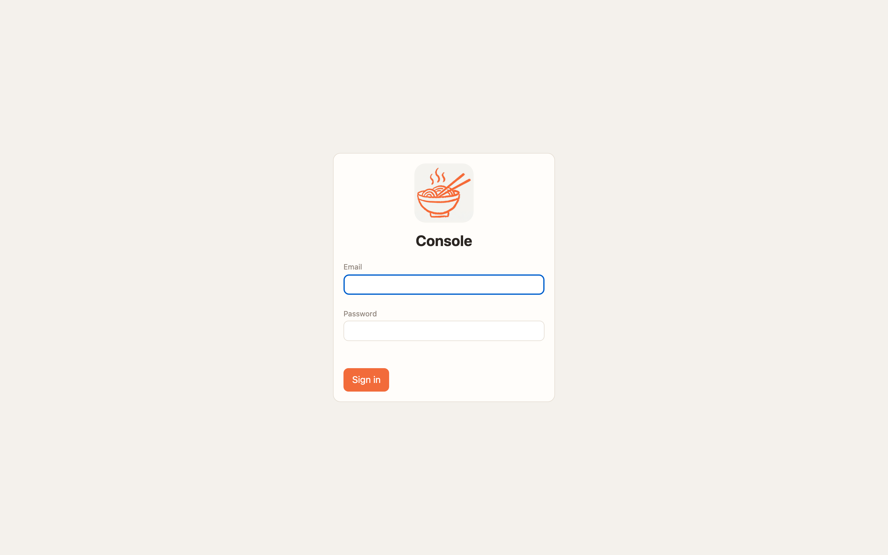
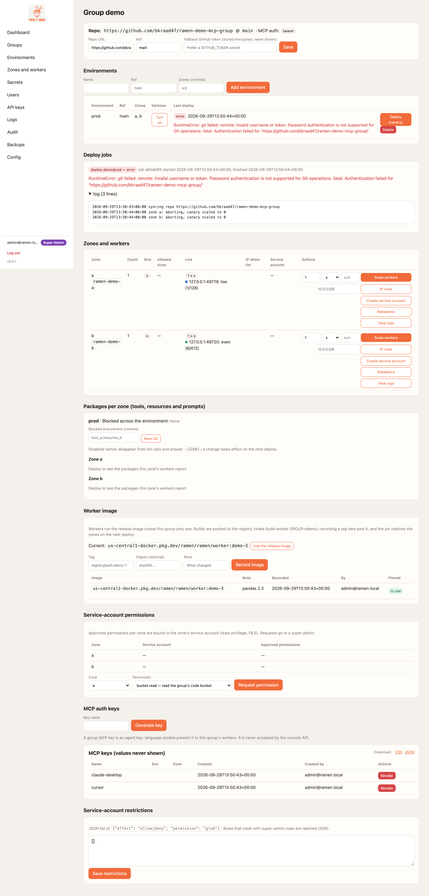

# Local quickstart

Runs the whole system on one machine with docker compose: a Firestore emulator, the console, and one worker
(group `demo`, zone `local`). Needs **Docker with compose v2**, **uv**, **git**, `make`. First run builds two
images (~3–5 min); later runs take seconds.

## 1. Start
```sh
git clone https://github.com/bkraad47/ramen && cd ramen
make up
```
`make up` copies `deploy/local/.env.example` to `.env` (once) and runs `docker compose up -d --build`.

| Service | URL | Notes |
|---|---|---|
| Console | **https://localhost:8443** | self-signed certificate — accept the browser warning (`curl -k`) |
| Worker (MCP) | **http://localhost:8080/mcp** | `GET /healthz` is 200 at once; `GET /readyz` only after the first deploy |
| Firestore emulator | http://localhost:8081 | state persists in the compose volume until `make down` |

**Login**: `admin@ramen.local` / `changeme-ramen` (from `deploy/local/.env`; change them there before exposing the stack).

<figure markdown>
{ .ramen-shot width=720 }
</figure>

## 2. Run the demo (creates data and proves the path)
```sh
make demo
```
Expected tail of the output (about 20–40 s after the stack is up; the first deploy pip-installs the demo repo's requirements):
```
login: 303
{"id":"local","name":"local", ...}            # zone, group, environment created (or "... exists" on a re-run)
ready: http://localhost:8080/readyz
tools: ['demo_calculator_tool']
demo_calculator_tool({"var1": 2, "var2": 3, "func": "add"}) -> 5
PASS: demo_calculator_tool(2,3,add) -> 5
```
The `PASS:` line is the success marker. `make demo` is safe to re-run: existing zone/group/environment answer
`... exists` and a fresh MCP key is minted each time.

What it did, through the console API: `POST /api/v1/zones {local}` → `POST /api/v1/groups {demo, repo_url}`
→ `POST /api/v1/groups/demo/environments {dev, zones:[local]}` → `POST /api/v1/groups/demo/mcp-keys` (an
`rmk_` key) → `POST .../environments/dev/deploy` → poll the job → call the tool with the official `mcp` client
(`deploy/local/mcp_call.py`).

!!! note "You do not need to add zones or groups by hand locally"
    The GCP/AWS guides ask you to create a zone and a group in the console. Locally `make demo` has already done
    that; the console shows zone `local` and group `demo` on first login.

## 3. Call the worker yourself
The worker only accepts **`rmk_` MCP keys** minted for the group (`RAMEN_MCP_KEYS` in `.env` is a dev fallback that
the compose stack also honours, default `local-mcp-key`). Mint one:

=== "Console"
    Groups → **demo** → *MCP auth keys* → enter a name → **Mint MCP key**. The key is shown **once**. Then click
    **Deploy (canary)** on the environment so the key reaches the worker.

=== "API (cookie session)"
    ```sh
    curl -sk -c c.txt -X POST https://localhost:8443/login -d email=admin@ramen.local -d password=changeme-ramen -o /dev/null
    CSRF="X-Ramen-CSRF: $(awk '$6=="ramen_csrf"{print $7}' c.txt)"   # cookie sessions must echo the CSRF token
    KEY=$(curl -sk -b c.txt -H "$CSRF" -H 'Content-Type: application/json' -X POST https://localhost:8443/api/v1/groups/demo/mcp-keys \
      -d '{"name":"laptop"}' | python3 -c 'import sys,json;print(json.load(sys.stdin)["key"])')
    curl -sk -b c.txt -H "$CSRF" -H 'Content-Type: application/json' -X POST https://localhost:8443/api/v1/groups/demo/environments/dev/deploy -d '{"canary":true}'
    echo "$KEY"    # rmk_<id>_<secret>
    ```

Now call it (JSON-RPC 2.0, MCP Streamable HTTP):
```sh
curl -s http://localhost:8080/mcp -H "Authorization: Bearer $KEY" -H 'Content-Type: application/json' \
  -d '{"jsonrpc":"2.0","id":1,"method":"tools/call","params":{"name":"demo_calculator_tool","arguments":{"var1":2,"var2":3,"func":"add"}}}'
# {"jsonrpc":"2.0","id":1,"result":{"content":[{"type":"text","text":"5"}],"isError":false}}
curl -s http://localhost:8080/mcp -H "Authorization: Bearer $KEY" -H 'Content-Type: application/json' -d '{"jsonrpc":"2.0","id":2,"method":"tools/list"}'
```
Without a key you get HTTP 401 with JSON-RPC error `-32001`. Any MCP client works the same way:
`deploy/local/mcp-client-config.example.json` is a ready `mcpServers` entry (URL `http://localhost:8080/mcp`,
header `Authorization: Bearer <rmk_key>`).

## `rmk_` vs `rmn_` — two different keys
| | `rmk_…` MCP key | `rmn_…` API key |
|---|---|---|
| Minted at | group page → *MCP auth keys*, or `POST /api/v1/groups/{g}/mcp-keys` | *API Keys* page, or `POST /api/v1/api-keys` |
| Sent as | `Authorization: Bearer rmk_…` to a **worker** `/mcp` | `X-Ramen-Api-Key: rmn_…` to the **console** `/api/v1/*` |
| Scope | one group; reaches every worker of that group on the next deploy | a console role (+ groups) never wider than the creator's |
| Use for | Claude Desktop, Cursor, agents, `curl` to tools | CI deploys, rotation, backups, scripting the console |

The *API Keys* page is **not** where worker keys come from. See [DevOps with the API](devops-api.md).

## 4. Look around
- **Dashboard** `/` — load per zone × group; *Refresh discovery* re-reads the adapter.
- **Groups → demo** — repo/ref, environments with **Deploy (canary)**, deploy jobs with streamed logs,
  zones/workers (scale, IP rules, rebalance, logs), loaded packages, MCP keys, SA restrictions.
- **Secrets** — add `{"name","value","env?","zone?"}`; values are never shown again. Reference as `{{$demo.NAME}}`.
- **Logs** — one JSON line per MCP call (`ts, ip, group, method, name, status, ms, key_id`); *download* gets the file.
- **Audit** — every mutation with user, IP, action, target, ok.
- **Config** `/config` — auth toggles (password login, magic link), OAuth providers, SMTP, SA rules, permission catalogue.
- **API docs** — `https://localhost:8443/api/docs` (OpenAPI).

## 5. Try the v0.3.0 controls (API, cookie session + CSRF header from §3)
```sh
# block a tool for the environment, redeploy, and watch tools/list hide it (calls answer -32601); unblock the same way
curl -sk -b c.txt -H "$CSRF" -H 'Content-Type: application/json' -X PUT https://localhost:8443/api/v1/groups/demo/environments/dev/blocked -d '{"blocked":["demo_calculator_tool"]}'
curl -sk -b c.txt -H "$CSRF" -H 'Content-Type: application/json' -X POST https://localhost:8443/api/v1/groups/demo/environments/dev/deploy -d '{"canary":true}'
curl -sk -b c.txt -H "$CSRF" -H 'Content-Type: application/json' -X PUT https://localhost:8443/api/v1/groups/demo/environments/dev/blocked -d '{"blocked":[]}'
# auth settings (super admin). Disabling password login needs another way in first (magic link, OAuth, or RAMEN_ADMIN_FORCE_PASSWORD=1) or you get 422.
curl -sk -b c.txt https://localhost:8443/api/v1/config/auth
curl -sk -b c.txt -H "$CSRF" -H 'Content-Type: application/json' -X PUT https://localhost:8443/api/v1/config/auth -d '{"magic_link":true}'
curl -sk -b c.txt -H "$CSRF" -H 'Content-Type: application/json' -X PUT https://localhost:8443/api/v1/config/auth -d '{"password_login":false}'
curl -sk -b c.txt -H "$CSRF" -H 'Content-Type: application/json' -X PUT https://localhost:8443/api/v1/config/auth -d '{"password_login":true,"magic_link":false}'
```
MCP keys live in the store, so `make down` (which discards the Firestore emulator) invalidates every key; mint again after a fresh `make up`.

<figure markdown>
{ .ramen-shot }
</figure>

## 5. Your own group repo
1. Copy the layout from [Protos](../wiki/protos.md) (or fork the demo repo).
2. Console → Groups → **Add group** with your repo URL and ref. Private repo: add a secret named `GITHUB_TOKEN`.
3. Add an environment with zone `local`, mint an MCP key, **Deploy**. Errors per package show up in the job.

## 6. Stop, reset, troubleshoot
```sh
make down                    # stop + delete volumes (Firestore data, buckets)
make logs                    # follow all containers
docker compose -f deploy/local/docker-compose.yml ps
```
| Symptom | Cause / fix |
|---|---|
| `curl: (60) SSL certificate problem` | self-signed cert: use `-k` |
| MCP call → 401 `-32001` | key not minted, or minted but not deployed yet; run a deploy |
| `/readyz` 503 on the worker | no deploy has loaded code yet; `make demo` or click Deploy |
| Deploy job `error` with pip output | `mcp/requirements.txt` failed to install; fix and redeploy |
| Old image versions in `docker compose ps` | `deploy/local/.env` pins `VERSION`; update it and `make up` |

Next: [GCP](gcp.md) · [AWS (untested)](aws.md) · [Secrets](secrets.md) · [Security](security.md)
