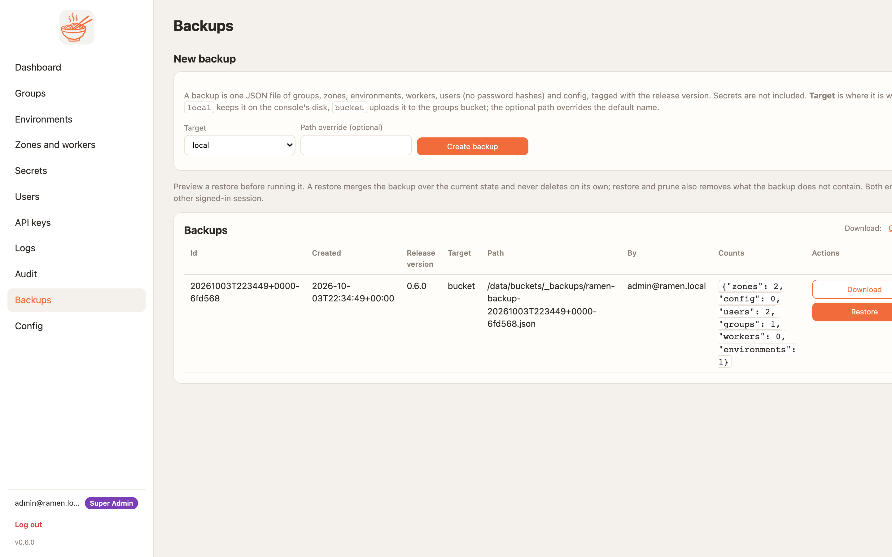

# Backups

A backup is a JSON export of six collections: groups, zones, environments, worker records, users and
configuration, tagged with the release version.

**It carries no secrets and no keys of any kind** — not their values and not their names. Secret records, MCP keys
and API keys are not in the export at all. Restoring over a live console leaves them alone, because the restore
only touches the six collections. Restoring into a fresh console gives you the groups and the people, and you
then re-add every secret and generate new keys. Password hashes and GitHub tokens are likewise absent and are
kept from the live document on a merge.

<figure markdown>
{ .ramen-shot }
<figcaption>Backups, each with Download, Preview restore, Restore, and Restore and prune.</figcaption>
</figure>

## Create

=== "Console"
    **Backups** (super admins) → **New backup** → target `local` (the console's `RAMEN_BACKUP_ROOT`) or `bucket`
    (the groups bucket, under `_backups/`).

=== "API"
    ```sh
    curl -s -H "X-Ramen-Api-Key: $RMN" -H 'Content-Type: application/json' \
      -X POST https://<edge>/api/v1/backups -d '{"target":"bucket"}'
    curl -s -H "X-Ramen-Api-Key: $RMN" https://<edge>/api/v1/backups/<id>/download > ramen-backup.json
    ```

Schedule it like anything else. A daily GitHub Actions job is ten lines:

```yaml
on:
  schedule: [{cron: "17 3 * * *"}]
jobs:
  backup:
    runs-on: ubuntu-latest
    steps:
      - run: |
          curl -fsS -H "X-Ramen-Api-Key: $RMN" -H 'Content-Type: application/json' \
            -X POST "$CONSOLE/api/v1/backups" -d '{"target":"bucket"}'
        env: {RMN: "${{ secrets.RAMEN_API_KEY }}", CONSOLE: "${{ vars.RAMEN_CONSOLE }}"}
```

An export is a few hundred kilobytes for a console with tens of groups, so keeping a month of daily copies costs
nothing. Ramen does not prune old backups; the bucket's own lifecycle rule is the place for that. The
[backup-restore skill](skills.md) does the same job for an agent operator.

Rehearse a restore before you need one: bring up a throwaway console with `RAMEN_STORE=memory`, restore the file
into it, and check the groups and people arrive. A backup you have never restored is a guess.

## Restore

1. **Preview** first. It prints what a restore would create, update and leave alone, and what the live store has
   that the backup does not. Nothing is written.
2. **Restore** merges each backup document over the live one. Fields the backup never held, such as password
   hashes, are kept from the live document.
3. **Restore and prune** also deletes what the backup does not contain. `config` is never pruned and the account
   running the restore is never deleted.
4. **Reconcile** re-applies every restored zone so counts, sizes and image pins take effect in the cluster. A
   namespace the cloud still runs that the backup never knew about is listed as an orphan, never deleted.

| Flag | Default | Meaning |
|---|---|---|
| `dry_run` | false | plan only |
| `prune` | false | delete what the backup lacks |
| `reconcile` | false | re-apply restored zones in the cluster |
| `force` | false | accept a backup taken on a newer release |

## What a restore does to people

Every restored user's session epoch is bumped, so everyone else is signed out at once. A user the store no longer
had comes back unable to sign in until an admin resets the password or they sign in through a provider.

## Moving between stores or clouds

Take a backup, bring the new console up with the new store settings ([Configuration](configuration.md)), restore
with `reconcile`, then re-add every secret, generate new MCP and API keys, and deploy each environment. Redeploy before expecting OAuth tokens to
verify: a restored group gets a new session secret on its next deploy.
