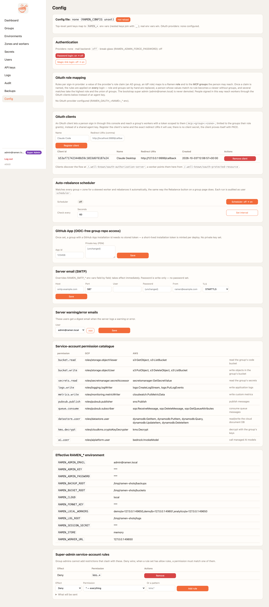

# Connect a client with OAuth

No shared key. The client sends you to the console, you sign in the way you always do, you approve the client
once for a group and a zone, and every call runs under your name. The console is the OAuth 2.1 authorization
server: PKCE, pre-registered public clients, no client secret, no dynamic registration.

## What an admin does once

1. **Config → OAuth clients → Register client**: a name and the redirect URI. Any loopback name and port is
   accepted, so `http://localhost/callback` covers Claude Code, Claude Desktop, Cursor and the bridge. The client
   id appears in the table.
2. Give the person a role in the group on the Users page. **MCP User** is enough.

<figure markdown>
{ .ramen-shot }
<figcaption>The Config page, where OAuth clients are registered.</figcaption>
</figure>

## What the person does

=== "Claude Code"
    ```sh
    claude mcp add-json ramen-demo '{"type":"http","url":"https://<edge>/mcp",
      "headers":{"ramen-group":"demo","ramen-zone":"a"},
      "oauth":{"clientId":"<client id>","scopes":"mcp:demo:a"}}'
    ```
    Then `/mcp` in Claude Code, pick *ramen-demo*, sign in. The browser opens the console's login page and then
    the consent page.

=== "Claude Desktop, Cursor"
    These clients find the flow by themselves from the worker's `401` and its
    `/.well-known/oauth-protected-resource` document, but the console does not support dynamic client
    registration, so they have no way to obtain a client id on their own and need one configured out of band.
    **Untested.** Until it is, give these clients a group key, or run them through the bridge, which takes
    `--client-id`.
    ```json
    {"mcpServers": {"ramen-demo": {"url": "https://<edge>/mcp",
      "headers": {"ramen-group": "demo", "ramen-zone": "a"}}}}
    ```

=== "The bridge (stdio)"
    ```sh
    pip install ramen-mcp-bridge
    ramen-mcp-bridge --target <edge>:443 --tls --oauth https://<edge> --client-id <client id> --group demo --zone a
    ```
    ```json
    {"mcpServers": {"ramen-stdio": {"command": "ramen-mcp-bridge",
      "args": ["--target", "<edge>:443", "--tls", "--oauth", "https://<edge>", "--client-id", "<client id>", "--group", "demo", "--zone", "a"]}}}
    ```
    The first run opens the browser. The refresh token is kept in `~/.config/ramen-mcp-bridge/` with mode 0600
    (`%LOCALAPPDATA%\ramen-mcp-bridge` on Windows, from bridge 0.2.1), and later runs need no browser.
    `--no-browser` prints the sign-in URL instead. Behind a self-signed certificate, such as the AWS guide's, add
    `--ca <pem>`: from bridge 0.2.2 it verifies the console during sign-in as well as the worker.

<figure markdown>
{ .ramen-shot }
<figcaption>What a person sees once: the client, the group and the zone it asks for.</figcaption>
</figure>

## What the token is

An access token lives one hour and names the person, the group and the zone (`mcp:demo:a`). The worker verifies
it on its own, without calling the console. The refresh token lives thirty days, rotates on every use and dies
when the person's role, password or account changes. The token runs every tool of the group in that zone, the
same reach as a group key, with the person's name on every log line.

The worker's access log shows `user:<id>` instead of a key id. The Audit page has the client registration and
every consent decision, and since 0.7.0 every token mint (`oauth.token`), refresh (`oauth.refresh`), a rotated-out
refresh token presented again (`oauth.refresh_reuse`, which revokes the family) and every refusal (`oauth.denied`
with its reason). The lifetimes are the console's `RAMEN_OAUTH_ACCESS_TTL` (seconds, default 3600) and
`RAMEN_OAUTH_REFRESH_TTL` (default 30 days), shown on the Config page.

### When the token expires mid-task

The worker refuses an expired token *before* the call reaches any tool code, with the same `401` and
`WWW-Authenticate: Bearer resource_metadata=...` challenge a request with no token gets, so an OAuth client (Claude
Code) refreshes and retries on its own, and the bridge does the same once for that one call. No browser appears
unless the refresh token itself is gone. The MCP session survives: session ids are bound to the person
(`user:<sub>`), not to one token, so the same `Mcp-Session-Id` keeps working with the refreshed token. A call that
started before expiry finishes (auth is checked on entry), and nothing runs twice: the only retry happens when the
`401` came back before dispatch. Refresh tokens Ramen holds are stored hashed, rotate on every use, belong to one
person and one group, and die when the person's role, password or account changes. Verified with a 3-second token
in `tests/conformance` for 0.7.0 (see the [changelog](../changelog.md)).

## What can go wrong

| Symptom | Cause |
|---|---|
| The client never opens a browser | The worker's metadata URL is relative because neither the Config page's base URI nor `RAMEN_PUBLIC_URL` was set when it was deployed. The deploy log says "OAuth tokens are off for this worker". Set one and redeploy. |
| Tokens refused after the base URI changed | Workers take the new issuer on their next deploy. Deploy each environment |
| Behind a path prefix, the client finds no authorization server | The proxy is missing the root route `/.well-known/oauth-authorization-server/<prefix>` ([Configuration](configuration.md#behind-a-reverse-proxy-or-a-path-prefix)). The bridge takes the prefixed console address, `--oauth https://<host>/<prefix>` |
| `404` on the metadata request | The client did not send the `ramen-group` and `ramen-zone` headers, so the load balancer had no zone to route to |
| The consent page says you have no access | Your account has no role in that group |
| `401` after a while | The refresh token ended because your role or password changed. Sign in again |
