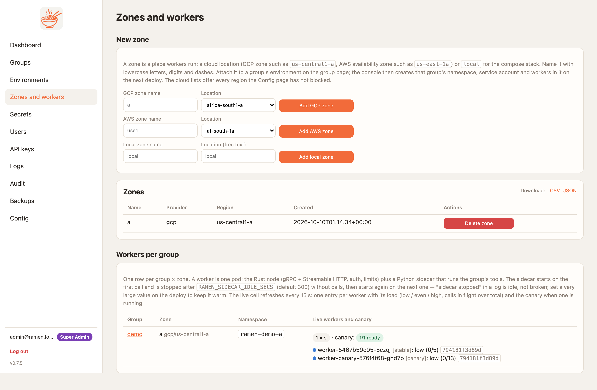
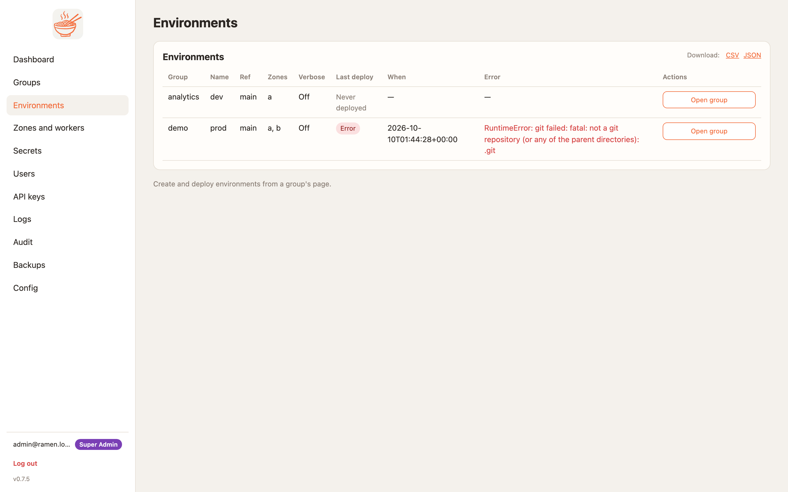

# Groups, zones and regions

| Term | What it is | Who manages it |
|---|---|---|
| **Group** | A team. One git repo at a ref, one bucket prefix, its secrets, keys, members and service-account rules. Deleting a group destroys its cloud resources. | Super admins create and delete; group admins run it |
| **Environment** | The group at a git ref, deployed to a set of zones, with a verbose flag, a blocked-package list and the last deploy result. | Group admins |
| **Zone** | Where workers run. A Kubernetes namespace `ramen-<group>-<zone>` pinned to a cloud zone, with its own service account, load-balancer route and IP rules. `local` is the compose worker. | Super admins create zones; group admins attach them to environments |
| **Worker** | One pod: the Rust node and the Python runtime. Two tracks per zone, `worker` and `worker-canary`. | Count by admins; size by super admins |

## Zones and regions

A zone has a name, a provider and a region. The region is the cloud location the workers pin to: a GCP zone such
as `us-central1-a`, or an AWS availability zone such as `us-east-1a`. The cluster is regional; a zone is one
location inside it. Two zones in two locations is what makes a group highly available: a client that fails on
`ramen-zone: a` retries with `ramen-zone: b` and reaches a different set of pods behind the same hostname.

**Zones and workers → Add zone** creates the record. Nothing runs until a group attaches the zone to an
environment and deploys. The page lists every zone and the worker counts per group.

<figure markdown>
{ .ramen-shot }
<figcaption>Two zones on a live GCP console. The worker counts come from the running pods.</figcaption>
</figure>

A zone that is deleted, or dropped from the last environment that used it, is torn down for real: the namespace,
its pods and routes, and the zone's service account or IAM role.

### Blocked regions (0.7.0)

A super admin can keep workers out of whole regions: **Config → Blocked regions** lists every GCP region and AWS
region (one checkbox dropdown per provider). A blocked region refuses new zones (`403 Region <r> is blocked by a
super admin`, on the page and at `POST /api/v1/zones`), and a zone that already sits in a region blocked later
fails its next deploy with the same message in the job log and a server warning, which the warning-email digest
carries to the people on the notify list. Other zones of the environment still deploy. Group admins cannot change
the list. `GET|PUT /api/v1/config/regions` with `{"gcp": [...], "aws": [...]}`; a GCP zone `us-west1-a` belongs to
`us-west1`, an AWS availability zone `eu-west-1a` to `eu-west-1`. On the zones page the location is a dropdown of the
provider's zones grouped by region, minus the blocked ones; `local` zones keep a free-text location.

## Creating a group

**Groups → Create group** with a name, the repo URL and the ref. A private repo needs a secret named `GITHUB_TOKEN`
on the group, or a GitHub App installation id with the App configured on the Config page. The console clones;
workers never do.

The group page is where the group lives: environments, deploy jobs, zones and workers, the packages each zone
serves, service-account permissions, MCP keys, the worker image and restrictions.

## Environments

**Add environment** on the group page: a name, a ref and the zones, picked from a checkbox list of the zones that
exist. Any group admin may attach any zone that exists, so a zone is a shared resource: a super admin decides
which zones exist at all, and that is the control over where a group can run. `dev` can follow `main` while `prod` sits on a tag. Rolling back is deploying the older ref.

The **Environments** page lists every environment you can see, across the groups you belong to, with the last
deploy flattened into the row: the outcome, when it ran, and the error if it failed. *Open group* goes to where
deploys are started.

<figure markdown>
{ .ramen-shot }
</figure>

## Deploying

**Deploy (canary)** on an environment runs, per zone:

1. **Sync** the repo at the ref into the group's bucket prefix.
2. **Write config**: the zone's Secret with the MCP keys, the secrets scoped to this environment and zone, the
   blocked list, the verbose flag and the IP rules.
3. **Canary**: restart `worker-canary` in place and wait for it to be ready. A new worker image or size goes to
   the canary only; the stable Deployment keeps its pod template until the canary has passed.
4. **Reload and smoke**: the canary pip-installs if `requirements.txt` changed, loads the packages, then answers
   `tools/list`.
5. **Gates (0.7.0)**: the canary's tools, resources and prompts are compared with what the zone's stable workers
   serve. A removed tool, resource or prompt, a removed input, a new required input, a changed type or a narrowed
   choice list is **breaking** and stops the deploy; additive changes pass and are listed. Then the repo's **golden
   cases** (`mcp/tests.yaml`, see [The MCP repo](mcp-repo.md#golden-cases)) run against the canary with the group's
   first MCP key; one failing case stops the deploy and the log names the case and the difference.
6. **Stable**: restart `worker` with the new template and wait.

Any failure in steps 3 to 6 scales the canary to zero and leaves the stable pods untouched, a bad image pin
included. A deploy refused as breaking offers **Deploy again, accept breaking changes** on its job card (the API
takes `"breaking": true`); clients that hold a session keep talking to the stable workers meanwhile and see the
new set on their next `tools/list`. The first deploy of a zone has nothing to compare against. On AWS the canary's share of traffic moves to the stable track before its pods change and comes back
once it passed. To deploy from a pipeline, see [Deploy from GitHub Actions](deploy-github-actions.md). The job log on the
group page shows each step. A stuck rollout names the pod that is not running and the scheduler's reason.

## Scaling and sizes

The group page's **Zone actions** card sets the worker **count** per zone. The autoscaler keeps at least that many pods and at
most twice as many. Super admins set the **size** (`s` 250m CPU and 512Mi, `m` 500m and 1Gi, `l` 1 CPU and 2Gi)
and the sizes a zone allows.

## Rebalance

The dashboard shows a load cell per zone and group: `low`, `even`, `high` or `down`, from each node's in-flight
count, where `low` is under 30% of the node's in-flight cap and `high` is over 80%. **Rebalance** in *Zone actions* adjusts the load balancer: on GCP the backend's capacity scaler, on AWS the
target-group weights. While the Gateway is still reconciling it answers `applied: false` with a note and retries
in the background. A super admin can turn on the **auto-rebalance scheduler** on the Config page; each run is
audited as `scheduler`.

## Packages per zone

After a deploy the group page lists what each zone reported: tools, resources and prompts with their schemas.
Since 0.7.0 each zone also shows its **manifest**: the hash of everything the workers serve (the same hash the
worker reports on its metrics) with the names and the exact schemas a client sees in a collapsed section. The live
workers cell shows each worker's hash and flags a **manifest mismatch** when the workers of one zone disagree, which
is what a half-finished rollout looks like.

### Tool access (0.7.2)

Per environment, a group admin can restrict single tools: who may **see** a tool in `tools/list` and who may **call**
it, by kind of caller: group keys, group admins, viewers, MCP users (super admins always may; a kind that may call may
list). A tool left out of the table is open to everyone with access to the group, as before. A caller who may not list
a tool gets `-32601 tool not found`; one who may list but not call gets `-32003 forbidden`. The worker enforces it on
both transports on the next deploy. Blocking (above) still removes a tool for everyone.

Since 0.7.5 the kinds include the [custom roles](users-access.md#custom-roles) a super admin defined: a caller whose
token carries `analyst` matches an entry naming `analyst` or its base. Access is decided before any
[guardrail](guardrails.md) runs, so a caller who may not call a tool gets `-32003` and no rail ever sees the payload.

### Drift (0.7.2)

The group page's **Drift** card shows, per zone and tool, how often the same caller repeated the same call (same
arguments, hashed, never stored) within a minute, from the worker's call log. A high rate is what an agent retrying
or abandoning a tool looks like. Above the threshold on the Config page (default 30 %) the console logs a warning the
digest email carries. `GET /api/v1/groups/{g}/zones/{z}/drift`.
**Disable** a package on one zone, or add it to **Blocked everywhere** on the environment. A blocked name
disappears from `tools/list` and answers the JSON-RPC error `-32601` until it is enabled again. The node enforces
it, so a bad tool can be pulled without a code change.

## IP rules

**IP rules** in the group page's *Zone actions* card takes a CIDR list. It becomes the node's allow-list and an edge rule: a Cloud Armor
policy per group on GCP, a WAF IP set per group on AWS. **The Cloud Armor policy is one per group**, so two zones
of the same group share the edge rule even though their node allow-lists stay separate. An empty list allows
every source. Include the console's
own range, because a deploy smoke-tests the worker as an ordinary caller. Changing rules rolls the zone's pods.

## Deleting

Deleting an environment tears down its zones' deployments for the group. Deleting a group tears down everything
it owned, in every zone, including its Cloud Armor policy on GCP and its WAF IP sets on AWS. On GKE a namespace can sit in `Terminating` for a while; [Deploy on GCP](deploy-gcp.md#gotchas)
says what to do if it never clears.
