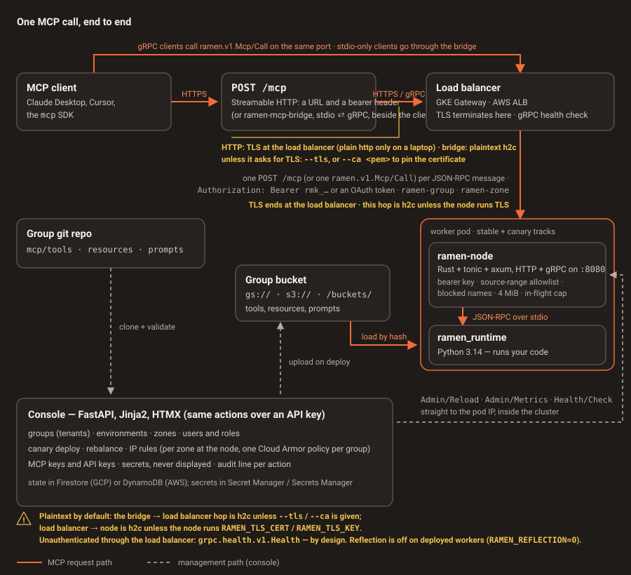

# Transport and what secures each hop

Since 0.5.0 a worker speaks two transports on one port, through one set of guards ([contract §16](../CONTRACTS.md)):

- **Streamable HTTP** — the front door. `POST /mcp` carries one JSON-RPC 2.0 message (MCP spec 2025-06-18); the
  credential is `Authorization: Bearer`, an `rmk_` key or a console-issued OAuth token. A URL and a header, so
  phones, browsers and hosted agent platforms are clients without installing anything.
- **gRPC** — `ramen.v1.Mcp/Call`, one message as `bytes body` ([§11](../CONTRACTS.md),
  [`mcp.proto`](https://github.com/bkraad47/ramen/blob/main/proto/ramen/v1/mcp.proto)). Kept for teams that want
  it internally, and what the stdio bridge speaks.

Nothing about MCP changed: the messages your client and your tools see are the standard ones. What matters for
security is that the HTTP handler does not have its own checks: it turns the request headers into the same metadata
map and calls the same guard and dispatch functions the gRPC service calls
([`node-rs/src/http.rs`](https://github.com/bkraad47/ramen/blob/main/node-rs/src/http.rs) →
[`grpc.rs::guard`](https://github.com/bkraad47/ramen/blob/main/node-rs/src/grpc.rs)). The conformance suite runs the
whole guard table on both transports so a check that drifts fails there first.

<figure class="ramen-diagram" markdown>

</figure>

## Why the node is Rust

A worker runs two processes with one job each.

- **`ramen-node` (Rust, [tonic](https://github.com/hyperium/tonic))** owns everything that must not be slowed down
  or broken by user code: the gRPC surface, key checking, source-range checking, the blocked-name filter,
  concurrency bounding, deadlines, health and the access log. It is a small, statically linked binary with no
  interpreter and no user code in its address space.
- **`ramen_runtime` (Python 3.14)** owns everything users write: `pip install`, proto validation, argument
  validation, secret substitution and the call itself.

They talk over newline-delimited JSON-RPC on stdin/stdout ([contract §2](../CONTRACTS.md)) — no socket, no port,
nothing extra to secure. The runtime is spawned when needed and killed after `RAMEN_SIDECAR_IDLE_SECS` of idleness,
so a crash, a hang or a leak in tool code costs one respawn rather than the pod that is holding the keys.

## Hop by hop

| Hop | What it is | What protects it |
|---|---|---|
| Client → edge (HTTP) | `POST https://<edge>/mcp` | TLS at the load balancer; the credential in `Authorization: Bearer`; a browser `Origin` must be on the zone's allowlist (see [Origin](#origin)); a session id is signed and bound to the credential (see [Sessions](#sessions)). The local compose worker is plain `http://` on the laptop only |
| Client → bridge → edge (stdio) | a child process on the client's own machine, speaking gRPC over HTTP/2 to the edge | process boundary on the client; **plaintext h2c unless you ask for TLS** — `--tls`, or `--ca <pem>` to pin the server certificate. The key comes from `RAMEN_MCP_KEY` |
| Edge → node | GKE Gateway, or an AWS ALB → the zone's pods | TLS terminates at the load balancer; the LB → node hop is h2c unless the node runs its own TLS (`RAMEN_TLS_CERT` + `RAMEN_TLS_KEY`). Cloud Armor IP rules apply here on GCP — **one policy per group**, not per zone; on AWS a WAFv2 IP set and a web-ACL rule per group, applied on a real account since 0.5.6 |
| Edge → node, without a key | `grpc.health.v1.Health`, and gRPC reflection where it is enabled | neither is key-checked or source-range-checked, so health answers anyone who reaches the edge — by design. Reflection would let them enumerate the services too, so it is switched off on deployed workers (`RAMEN_REFLECTION=0` in the chart and both renderers) and answers `UNIMPLEMENTED` there; it stays on locally |
| Anything else → the pod, directly | other pods, or the cluster network | the worker `NetworkPolicy` (on by default): ingress to the node port only from the console's namespace and the load-balancer / health-check ranges. This — with the hardened container context — is what actually bounds direct access, and what makes the unauthenticated surface above tolerable |
| Node (every `Mcp/Call`) | the guard in front of your code | bearer key compared byte-for-byte in constant time with no early exit between keys (the length check in front of that compare is *not* constant time, so a key's length can leak); source range checked against `RAMEN_ALLOWED_CIDRS`; blocked names filtered; 4 MiB message cap; `RAMEN_MAX_INFLIGHT` cap |
| Node → runtime | JSON-RPC on stdio inside the pod | no network surface; the runtime is a child process of the node |
| Runtime → bucket | read of the group's prefix, by content hash | the zone's own cloud identity, scoped to that group's bucket prefix and that group's secrets. The AWS equivalent is an IAM role with IRSA, applied on a real account since 0.5.6 |
| Console → node | `Admin/Reload`, `Admin/Metrics`, `Health/Check` on the pod IP | cluster-internal, and plaintext h2c unless the console itself has `RAMEN_WORKER_TLS=1`; `Admin/*` additionally needs `x-ramen-admin-key` and `RAMEN_ADMIN_CIDRS`, and is not routed through the load balancer at all |

### The bearer key
`Mcp/Call` requires metadata `authorization: Bearer <key>`. The node compares the presented key against every
configured key in `RAMEN_MCP_KEYS` with a constant-time byte comparison, and folds over the whole key set without
an early exit on the first mismatch
([`node-rs/src/auth.rs`](https://github.com/bkraad47/ramen/blob/main/node-rs/src/auth.rs)). One caveat, so it is
not read as more than it is: the byte compare is guarded by a plain length test, and that test is not constant
time — the *length* of a configured key can still be inferred from timing, though its bytes cannot. A miss is gRPC
`UNAUTHENTICATED`, and **an empty key set denies everyone** rather than letting everyone in. Error details never
echo key material.

Keys are generated per group in the console and written into the zone's config on deploy. Rotation is one
action — the deploy rewrites the zone's Secret and rolls both Deployments for you — but it is not *instant*
revocation: the old pods keep accepting the old key set until they finish draining, and the deploy job waits up
to 180 s for that. Assume a revoked key still works for a few minutes.

One thing the access log does give away: every call is logged with a `key_id`, which is a short unsalted hash of
the key that was presented. It is not key material, and the log never contains the key itself — but anyone who
can read worker logs can hash a candidate key and see whether it appears. Worker logs are sensitive.

### The source-range allowlist
`RAMEN_ALLOWED_CIDRS` is checked against the caller's address; outside it the call is `PERMISSION_DENIED`, and
IPv4-mapped IPv6 addresses are normalised before the match.

Which address counts as the caller's is the whole question, because behind a load balancer the peer *is* the
load balancer. `RAMEN_TRUST_PROXY_HOPS = n` answers it: take the **n-th `x-forwarded-for` entry counted from the
right**. Proxies *append* to that header, so its right-hand end is the part they wrote and everything left of it
is whatever the caller chose to send. Skipping the `n - 1` right-hand entries your own proxies added lands
exactly on the address the outermost trusted proxy observed — an address a caller cannot pick. Set the count
correctly and the node's allowlist is a genuine check on the client address.

Everything else falls back to the **peer address**: trust off (`n = 0`), no header at all, fewer than `n`
entries, or an entry at that position that will not parse. That direction matters. Behind a load balancer the
peer is the proxy, so a client-range allowlist stops matching and starts denying — a wrong hop count costs you
availability, not confidentiality. It fails closed.

| Where | `RAMEN_TRUST_PROXY_HOPS` | why |
|---|---|---|
| GCP, behind the external load balancer | `2` | the load balancer appends the client, then itself |
| AWS, behind the ALB | `1` | the ALB appends the client |
| local, compose, or straight to a pod | `0` (the default) | there is no proxy — the peer *is* the client |

The worker chart and both console renderers set it per provider; you can override it, including to `0`. The
legacy `RAMEN_TRUST_PROXY=1` still works and means one hop, and an explicit `RAMEN_TRUST_PROXY_HOPS` wins over
it in both directions, so `HOPS=0` is an explicit off switch.

What this list is *not* is the thing that stops something reaching a worker directly — that is the
[`NetworkPolicy`](#what-bounds-direct-access-to-a-pod). The allowlist decides which clients a reachable worker
will answer.

**Unset, `RAMEN_ALLOWED_CIDRS` defaults to `0.0.0.0/0` and `::/0` — every source is allowed**, and the bearer
key is the only gate. Setting per-zone IP rules in the console is what populates it on deploy.

`RAMEN_ADMIN_CIDRS` defaults to any in the same way and the console never writes it, so `Admin/*` stays reachable and `x-ramen-admin-key` is the gate
that always applies there. That does **not** make an IP lock free of consequences: a deploy also smoke-tests
`tools/list` as an ordinary `Mcp/Call` from the console, and that call *is* subject to `RAMEN_ALLOWED_CIDRS`. A
lock must therefore include the console's own source range as the worker sees it, or every later deploy fails at
the smoke step with `PERMISSION_DENIED` — which is why the cloud IP-rules test skips itself unless it is given
that range to add to the lock.

### TLS
TLS terminates at the load balancer, which is the hop that crosses the internet. Everything behind it is
cleartext HTTP/2 by default — that is what GKE's `appProtocol: kubernetes.io/h2c` means, and it is the path that
was verified on a live GKE Gateway in 0.3.2. If you want the last hop encrypted too, give the node
`RAMEN_TLS_CERT` and `RAMEN_TLS_KEY` and switch the Service to `HTTP2`; that mode has local tests but has not
been exercised in a cloud deployment. Since 0.5.1 the node terminates TLS itself and offers both `h2` and
`http/1.1` on ALPN — tonic's own acceptor offers only `h2`, which refused every Streamable HTTP client at the
handshake (CI caught it after 0.5.0; the laptop had skipped the case for want of `openssl`).

**Turning on node TLS is two changes, not one.** The console dials worker pods with an insecure channel unless it
is *also* given `RAMEN_WORKER_TLS=1` (plus `RAMEN_WORKER_CA`, or `RAMEN_WORKER_CERT` / `RAMEN_WORKER_KEY` for a
client certificate). Give the node TLS without the console side and the console keeps speaking cleartext to a TLS
port, so every `Admin/Reload` — and therefore every deploy — fails.

Clients choose their own side: `ramen-mcp-bridge` is plaintext unless you pass `--tls` or `--ca`. Two details
that catch people out:

- **`--insecure` overrides `--tls` and `--ca`** instead of conflicting with them. A leftover `--insecure` in an
  `mcpServers` entry downgrades the connection silently, with no warning and no error.
- **`--ca <pem>` replaces the trust store**, it does not pin a certificate in the strict sense — the connection
  still verifies the hostname, it just anchors trust in that PEM. And because the Gateway certificate is
  self-signed until you supply a domain certificate, `--tls` on its own fails with
  `CERTIFICATE_VERIFY_FAILED`; in practice `--ca` is required, not optional. That exact mistake cost a run in
  the 0.3.2 cloud verification.

### Blocked names
Names in `RAMEN_BLOCKED` are filtered out of `tools/list`, `resources/list` and `prompts/list` and answered with
JSON-RPC `-32601` when called — by name, and for resources by URI as well as by resolved name. Blocking is set in
the console per environment and per zone, so a model connected to one zone cannot see or call what that zone has
switched off.

### Sessions
`initialize` over HTTP returns an `Mcp-Session-Id` of the form `<nonce>.<expiry>.<mac>`, where the MAC is
HMAC-SHA256 over the nonce, the expiry and the id of the credential that made the call, keyed with the zone's
`RAMEN_SESSION_SECRET`. Nothing is stored: any pod in the zone verifies an id, so there is no affinity to configure
and a rollout keeps sessions alive. Presented under another credential, past expiry (30 min by default) or altered,
the id is `404` — the spec's signal to re-initialize — never `401`, so a stolen id reveals nothing and cannot be
replayed with a different key. The console writes the secret into every zone's deploy Secret; a group cannot set it
from its own deploy file. Without it the node generates one per process and says so in its log, and sessions then
die with the pod.

### Origin
A request that carries a browser `Origin` header is refused with `403` unless the origin is on
`RAMEN_ALLOWED_ORIGINS` — and that list is **empty by default**, so a page on another site cannot use a victim's
browser to reach a worker through DNS rebinding. Non-browser clients send no `Origin` and are unaffected. A group may
open its own web origins from its deploy file; `*` is for a laptop.

### OAuth tokens
When `RAMEN_OAUTH_ISSUER` names the console, a worker also accepts an HS256 access token the console minted for one
signed-in user: signature (key derived from the same zone secret), `exp`, issuer, audience and scope
(`mcp:<group>:<zone>`) must all check out, and the access log then names the user rather than a key id. Tokens live
one hour and are not individually revocable; refresh tokens are, through the user's session epoch. The worker
publishes `/.well-known/oauth-protected-resource` and answers a missing credential with
`WWW-Authenticate: Bearer resource_metadata=…`, which is how an OAuth-capable client finds the console. Two
practical notes: the metadata URL is absolute only when the deploy set `RAMEN_PUBLIC_URL` on the worker (the console
does so for a cloud zone; a pod cannot know its public address on its own), and behind a load balancer that routes
on `ramen-group`/`ramen-zone` a client must send those headers on the metadata request too, or the balancer has no
zone to send it to. Details and what the console checks before minting: [Security](../how-tos/security.md).

### The unauthenticated surface
Three things run ahead of every guard — no key, no source-range check: `grpc.health.v1.Health`, deliberately, so
that load balancers and Kubernetes can probe it; `GET /.well-known/oauth-protected-resource`, which is public
metadata by design (RFC 9728) and names only the console's URL and the resource identifier; and gRPC **server
reflection** (`v1` and `v1alpha`), so that `grpcurl` works without a local copy of the proto.

Reflection is convenient on a laptop and a disclosure at an edge: anyone who could reach it could list the
services and print their definitions, `ramen.v1.Admin` included, from a source range the MCP allowlist denies.
So it is gated by `RAMEN_REFLECTION`, which is **on by default and switched off on deployed workers** — the
worker chart and both console renderers set `RAMEN_REFLECTION=0`. With it off the reflection services are not
registered at all and answer `UNIMPLEMENTED`, so what the load balancer will list for an anonymous caller is
nothing. Locally and in compose, where the port is not exposed to anyone else, reflection stays on.

Health remains unauthenticated everywhere by design. It reports readiness and nothing more.

### What bounds direct access to a pod
The worker `NetworkPolicy` (enabled by default) admits ingress to the node port only from the console's namespace
and from the load balancer's front-end and health-check ranges — the VPC CIDR on AWS. Together with the hardened
container context (non-root, `allowPrivilegeEscalation: false`, all capabilities dropped, `RuntimeDefault`
seccomp) it is the control that answers "what stops another pod, or the internet, from reaching the node
directly", and it is what makes the unauthenticated health and reflection surface tolerable. It is also what
closed the direct-access item of the 0.3.0 security audit.

### The deploy file is a configuration channel
The node's configuration comes from three places, in order: a `RAMEN_CONFIG` yaml, then the process environment,
then the deploy file the console writes into the group's bucket (`.ramen/env-<zone>`), re-read on every
`Admin/Reload`. That last source is a channel, not just data, and it is worth knowing both halves of what it can
do. It **can** set `RAMEN_MCP_KEYS` and `RAMEN_ALLOWED_CIDRS` — so write access to a group's bucket prefix is the
ability to add an MCP key and to widen that zone's address allowlist — along with the block list, the in-flight
and timeout limits, the idle timer and the log file. It deliberately **cannot** set the bucket, the port, the
Python interpreter, the group or zone identity, the admin key, or the proxy-trust setting. That exclusion list is
a real control: the same write access cannot repoint a worker at another group's code, take over its admin
surface, or change how it decides a caller's address.

### Per-zone cloud identity
Attaching a zone creates its own cloud identity, bound to the zone's Kubernetes service account: on GCP a service
account with `objectViewer` limited to that group's bucket prefix and `secretAccessor` limited to that group's
secrets, through Workload Identity. Two zones of two groups on the same cluster therefore cannot read each other's
code or secrets even if the network is misconfigured. The AWS equivalent is an IAM role with IRSA, applied on a real
account since 0.5.6.

The separation is about *contents*, and one edge is worth naming: the IAM condition that scopes the storage role
matches the group's object prefix **or the bucket resource itself**, because that is what a bucket listing is
checked against. A group's worker identity can therefore enumerate object names across the shared groups bucket,
including other groups' paths. It cannot read those objects — only see that they exist.

### Transport errors versus protocol errors
gRPC status codes describe the edge, JSON-RPC errors describe your code. A bad key is `UNAUTHENTICATED`, a blocked
source range is `PERMISSION_DENIED`, an oversized message is `OUT_OF_RANGE`, too many in-flight calls is
`RESOURCE_EXHAUSTED`; a blocked or unknown tool is JSON-RPC `-32601` and an exception in your tool is
`isError: true`. A client can always tell "the edge rejected me" from "the tool said no". One caveat on that
in-flight cap: the semaphore is sized when the pod starts and an `Admin/Reload` does not resize it, so although
a deploy is allowed to set `RAMEN_MAX_INFLIGHT`, the new value only takes effect the next time the pod
restarts. `grpc.health.v1.Health`
is unauthenticated by design, so load balancers and Kubernetes can probe it, and it reports `SERVING` only after
the runtime has actually loaded the group's code.

## What is verified, and what is not

- **Verified live in 0.5.1 on one GKE Autopilot cluster through the Gateway load balancer**: `POST /mcp` with an
  `rmk_` key routed by `ramen-group`/`ramen-zone` to the zone's pods, the 401/403 answers and the session id
  through the balancer, the OAuth flow from the console's consent page to a `tools/call` with the token, refresh
  rotation and reuse revocation, and the worker's RFC 9728 challenge naming the console
  (`scripts/oauth_roundtrip.py`, `scripts/cloud_smoke.sh`). The harness ran 218 passed, 0 failed, 15 skipped with
  stated reasons. Two things the run taught: the
  Gateway takes minutes to program a new route (until then `/mcp` is a `404` from the console), and a console
  rollout answers `503` through the balancer for about a minute.
- **Verified in 0.5.0 on real node processes:** the whole guard table on both transports (key,
  source range, blocked names, 4 MiB and in-flight caps, protocol errors as JSON-RPC bodies, notifications), the
  HTTP-only checks (Origin, sessions bound to the credential and refused under another key, content negotiation,
  protocol version, the RFC 9728 metadata), a console-minted OAuth token accepted by the node, and the official
  `mcp` SDK's Streamable HTTP client end to end. All of it runs in CI on Linux and on a Windows runner that builds
  the node natively (`tests/conformance/test_transports_local.py`). Since 0.5.1 it also covers Streamable HTTP over
  node TLS, which CI found broken after 0.5.0 (see TLS above).
- **Verified live**, on one GKE Autopilot cluster in `us-central1` (0.3.2), with the whole harness green through
  the load balancer (126 passed, 0 failed):
    - header routing on `ramen-group` / `ramen-zone` over h2c, and gRPC health checks;
    - `Mcp/Call` with and without a key (`Unauthenticated` without); `Admin/*` not reachable through the load
      balancer; the bridge end to end through the official `mcp` SDK stdio client against `<edge>:443` with
      `--tls --ca`;
    - **driven from the console, against the real deployment**: blocking a tool and unblocking it again; setting
      an IP lock (the node answered `PERMISSION_DENIED` outside the range while health stayed reachable, with the
      Cloud Armor policy in place) and restoring it; canary deploy and rollback; rebalance; the per-zone service
      account with its bucket-prefix and per-secret IAM bindings and its Workload Identity binding; secrets; and
      logs.
    - Scope, stated plainly: **one** cluster, one zone, one group, on one day, and the project was deleted the
      same day. Later releases repeated the pattern (0.5.1, 0.5.6, 0.5.8, 0.5.95), each on a project or
      account torn down the same day; nothing stays running between releases.
- **Verified by tests only**: node TLS, the `RAMEN_MAX_INFLIGHT` and size caps, and `x-forwarded-for` hop
  counting — including a test that a caller-supplied header cannot move the address the node checks, at each
  provider's hop count. Note what that does *not* say: the hop counts above (GCP 2, AWS 1) and
  `RAMEN_REFLECTION=0` landed **after** the 0.3.2 cloud run, so neither has been exercised against a real load
  balancer yet. The next cloud run is what will confirm that GCP really appends two entries.
- **Verified on AWS since 0.5.6**: the Terraform for EKS, DynamoDB, S3, Secrets Manager and the ALB with gRPC
  target groups has been applied to a real account, and the published bridge was server-tested against it in
  0.5.8 (which is how the certificate's SAN gap was found). Least exercised there: WAF rule convergence under
  change, and rebalance weights under load. [The AWS how-to](../how-tos/aws.md) says what each run covered.
- **By design, not a defect**: the runtime executes your group's code in a process that holds that group's
  secrets in its environment. Tool code in a group can read that group's secrets directly. Isolation between
  groups is the pod, the namespace and the per-zone identity — not the Python process. See
  [Security](../how-tos/security.md).

## Connecting

Standard MCP clients do not see any of this. The front door is a URL and a header:

```json
{"mcpServers": {"ramen": {"url": "https://<edge>/mcp",
  "headers": {"Authorization": "Bearer ${RAMEN_MCP_KEY}", "ramen-group": "<g>", "ramen-zone": "<z>"}}}}
```

Keep the key in `RAMEN_MCP_KEY` rather than in the file. Leave `Authorization` out and an OAuth-capable client will
follow the worker's `401` to the console and sign the user in for a token scoped to that person.

Clients that only speak stdio use `ramen-mcp-bridge`, a stdio MCP server that forwards each message to `Mcp/Call`
over gRPC — the compatibility path, unchanged since 0.3.1:

```sh
RAMEN_MCP_KEY=<key> ramen-mcp-bridge --target <host:port> --group <g> --zone <z> [--tls|--insecure] [--ca <pem>]
```

Every flag has an environment variable behind it (`RAMEN_BRIDGE_TARGET`, `RAMEN_BRIDGE_GROUP`, `RAMEN_BRIDGE_ZONE`,
`RAMEN_BRIDGE_TLS`, `RAMEN_BRIDGE_CA`; the key from `RAMEN_MCP_KEY` or `RAMEN_BRIDGE_KEY`). Never pass `--key` on a
shared machine: a command line is visible to every other user through `ps`.

The local compose stack is the other place to be careful. It publishes the worker on host port 8080 as plaintext
h2c with an open address allowlist, a committed MCP key and a committed admin key, and no `RAMEN_ADMIN_CIDRS` —
so on a developer laptop `Admin/Reload` is reachable by anything that can reach the port, using a key that is in
this repository. That is fine for `make up` on a machine you control and is not a deployment posture.

Anything that speaks gRPC can skip the bridge and call `ramen.v1.Mcp/Call` directly. Locally, server reflection
is on, so `grpcurl` works without a local copy of the proto; against a deployed worker it is
[switched off](#the-unauthenticated-surface), so pass `-import-path proto -proto ramen/v1/mcp.proto` there. See the
[local quickstart](../how-tos/local-quickstart.md) and [Protos](protos.md).
