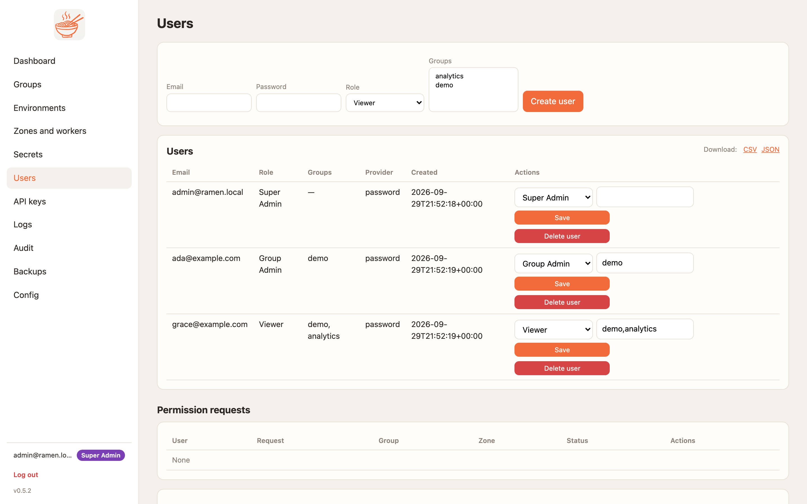
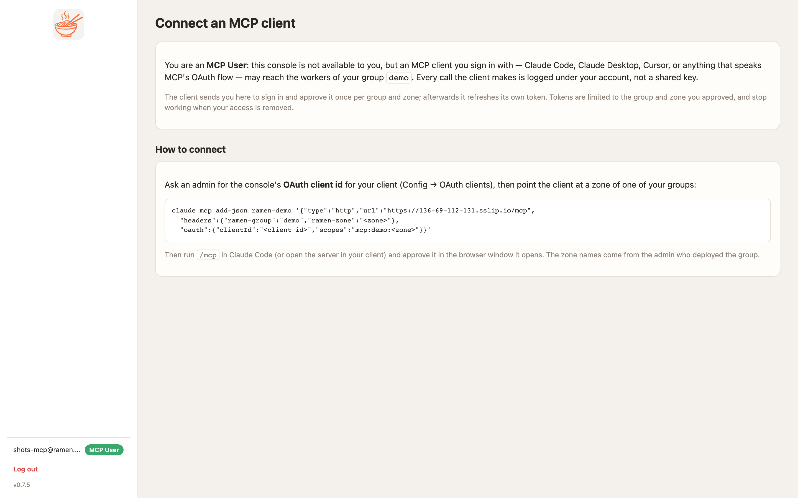

# Users and access

A person holds a role **in each group**. Super admins are global. One person can be a Group Admin of one group, a
Viewer of three and an MCP User of two more.

| Role | May |
|---|---|
| **Super admin** | Everything: users, groups, zones, sizes, API keys, backups, audit, config, the OAuth clients, the service-account rules |
| **Group admin** (per group) | Environments, deploys, worker counts, secrets, MCP keys, IP rules, throttles, rebalance, the group's members below admin, requests for its zones' identities, the group's restrictions |
| **Viewer** (per group) | Read: the repo, load, packages, deploy jobs and logs. Not the Secrets page |
| **MCP user** (per group) | Sign in and approve an OAuth MCP client for a zone of the group. One page in the console, and `/api/v1/me`. Nothing else |

Group admins cannot approve their own permission requests, grant a role above their own, or see other groups.
A person with no membership anywhere sees only their own account page.

## Custom roles

Since 0.7.5 a super admin can define roles of their own on the Config page's **Roles** card (or
`PUT /api/v1/config/roles/<name>`). A custom role has a **base**, one of Group Admin, Viewer or MCP User, which is
what the console lets it do; a label; and an **OAuth only** switch. Its name is what makes it useful elsewhere:

- **Per-tool access** ([groups and zones](groups-zones.md)) can list or call a tool for `analyst` without opening it
  to every viewer. A caller with a custom role matches a tool-access entry that names the role *or* its base, so a
  custom role never has less than its base.
- **Identity provider rules** ([Entra ID and Workspace](sso.md)) can map a provider group straight to it.
- **OAuth only**: a person holding the role in any group cannot sign in with a password or a magic link; the login
  page answers `403 This account signs in with <provider>`. The built-in roles cannot be made OAuth-only.

The person's token carries the custom role name, so workers enforce it on both transports. Workers learn the
roles and their bases (`RAMEN_ROLES`) on the group's **next deploy**, like per-tool access: until then a new role
matches no tool-access entry on that worker (it fails closed). Deleting a role that a
membership, a provider rule or a tool-access entry still uses is refused (`409`) until those are changed. Names are
lowercase, `a-z0-9_`, up to 32 characters, and may not shadow a built-in.

## Where a membership comes from

Each membership shows its source on the Users page: *set here* for what an admin gave on this page or through
`PUT /api/v1/groups/<g>/members/<uid>`, *via <provider>* for what the identity provider's rules decided at the last
sign-in. The provider rewrites its own entries at every sign-in and never touches the admin's; where both name the
same group the admin's entry wins. Removing a person from a provider group removes that membership at their next
sign-in, and their sessions end, unless an admin entry keeps it. Details on [Entra ID and Workspace](sso.md).

## The Users page

One member table per group with a role dropdown, **Remove** and **Add member** by email, then the account table
and the pending permission requests. Super admins create accounts with a password; group admins add existing
accounts to their groups and reset their members' passwords. Accounts that sign in through an identity provider
show *Signs in through <provider>* instead of a password form.

<figure markdown>
{ .ramen-shot }
<figcaption>Members per group, then every account.</figcaption>
</figure>

Passwords need twelve characters with four character classes. Failed sign-ins are rate-limited per address and
audited.

## How a person signs in

Password and magic link are on by default. A super admin can add Microsoft Entra ID or Google Workspace on the
Config page and map claim values to roles per group; see [Entra ID and Workspace](sso.md). Disabling password
login needs another way in first, or the break-glass `RAMEN_ADMIN_FORCE_PASSWORD=1`.

Every role, group and password change bumps the person's session epoch. Open sessions and refresh tokens end
at once. There is no window where an open tab keeps a permission it just lost.

## What an MCP user gets

An MCP user who signs in sees one page: which groups they may connect to and how. Claude Code, Claude Desktop,
Cursor and the bridge send them to the console to sign in and approve the client once per group and zone. Every
call is logged under their account. [Connect with OAuth](connect-oauth.md) and
[connect with a password](connect-password.md) show both sides.

<figure markdown>
{ .ramen-shot }
<figcaption>The MCP user's page: the groups they may connect to and the client command.</figcaption>
</figure>

## Service-account permissions

Each zone's workers run as their own cloud identity: a GCP service account with Workload Identity, an AWS IAM
role with IRSA. It starts with the least it needs: read the group's prefix of the bucket and the group's secrets.
Everything more is requested and approved.

1. **A super admin sets the rules** on the Config page: `deny kms.*` style rules that gate what anyone may
   request. Deny wins; when allow rules exist a permission must match one. A group admin can add stricter
   restrictions on the group page.
2. **A group admin requests** on the group page: a zone, a permission from the catalogue and a **scope**. Empty
   or `*` means the group's own area. Named buckets or secrets bind the permission to those alone.
3. **Another admin of the group, or a super admin, approves.** The console binds the cloud roles and records the
   permission and its scope on the zone.
4. **Revoke** on the badge takes it back and unbinds exactly what was bound. `bucket.read` and `secrets.read` keep
   the baseline the worker needs to load its own code.

| Permission | GCP | AWS |
|---|---|---|
| `bucket.read`, `bucket.write` | `roles/storage.objectViewer` or `objectUser` on the group prefix or the named buckets | `s3:GetObject`, `ListBucket` or `PutObject`, `DeleteObject` on the prefix or the named buckets |
| `secrets.read` | `secretAccessor` on the group's secrets or the named ones | `GetSecretValue` on the group's path or the named secrets |
| `logs.write`, `metrics.write`, `pubsub.publish`, `queue.consume`, `datastore.user`, `kms.decrypt`, `ai.user` | project-wide roles; need `console_project_iam = true` in Terraform | account-wide actions on the role's inline policy |

Every request, approval and revoke is audited with the user, group and permission as tags.

## Audit and logs

**Audit** (super admins) keeps every console action with the user, address, outcome and tags, failed sign-ins
included. The newest hundred are on the page with a search box and an outcome filter; CSV and JSON downloads give
the whole log.

**Logs** shows each worker's access log: one JSON line per MCP call with the time, address, method, tool name,
status and the key id or `user:<id>`. Entries are newest first on the left and the selected one opens on the
right. In the cloud it reads Cloud Logging or CloudWatch. The verbose flag on an environment logs full request and
response bodies; turn it on only while debugging.

<figure markdown>
{ .ramen-shot }
<figcaption>One line per call. This one names the key id; a call made with a person's token names the person.</figcaption>
</figure>

<figure markdown>
{ .ramen-shot }
</figure>
